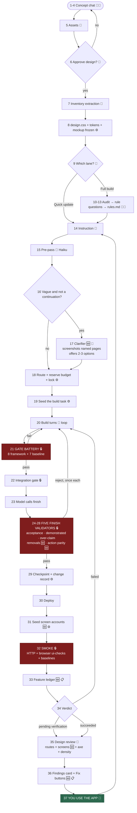

# The Mock2 pipeline, step by step

Every step from the first mockup prompt to the last quick update, what the
platform does at each one, and what you should expect out of it.

Written to be **edited**. The right-hand column of each table is the one to
argue with — it says what the step is *for*, and several of them are not
earning it.

## How to read this

| Marker | Means |
|---|---|
| 👤 | **You.** Nothing happens without this. |
| 🧠 | **A model call.** Costs money. Named where the model differs from the session default. |
| ⚙️ | **Deterministic check.** No model. Same input, same answer, every time. |
| 🔒 | **Blocking.** Fails the build or rejects the finish. |
| 📋 | **Advisory.** Reported, never blocks. |
| 🆕 | **Postdates project 34.** P34 was built without this. |

**P34 baseline note.** Roughly half of what follows did not exist when project
34 was built. Every 🆕 is a candidate for removal if you want that baseline
back. They are marked, not recommended — the audit in `docs/gate-audit.md` says
which ones are actually earning their place.

---

## Flowchart

---

# Phase 1 — Concept

Goal: a mockup you'd be happy to use, and an inventory extracted from it.

| # | Step | What runs | Expected outcome |
|---|---|---|---|
| 1 | 👤 Describe the app in Concept chat | — | The brief. **This is the highest-leverage text you will write.** See `docs/` prompt guidance: describe the *content the screens hold*, not just the features, or the renderer's own domain prior fills the vacuum. |
| 2 | 🧠 Concept reply | `concept_chat` slot, ~6k in / 1.5k out | A design partner's response. It **cannot write code, files, or rules** — the mockup tool is its only output. |
| 3 | 🧠 Mockup render | Separate design model, ~12k in / 9k out | A full HTML document. **Your brief OUTRANKS the locked design system** wherever it speaks — an explicit palette, theme or type spec is binding. Silence hands the decision to the default. |
| 4 | 👤 Iterate (repeat 1–3) | — | Converge on a screen you'd use. Cheapest place in the whole pipeline to change your mind. |
| 5 | 👤 Add assets (optional) | — | Logo, brand colours, real wording feed the next render. Placeholders are what generic mockups are made of. |
| 6 | 👤 **Approve design** | — | Locks the visual contract. One-way for practical purposes. |
| 7 | 🧠 Inventory extraction | ~14k in / 4k out | `state/inventory.json` — screens, fields, **actions**, states. ⚠️ **The action labels here become contract strings that later gates hunt for.** Vague or verbose action names cost you later. |
| 8 | ⚙️ Freeze the contract | — | `state/mockups/current.html`, `state/design.css` (component CSS lifted verbatim), `state/design-tokens.json`. Build unlocked. |

**Expected outcome of Phase 1:** a mockup, an inventory, and a frozen design
vocabulary. **The mockup is disposable; the inventory is not.**

---

# Phase 2 — Define (Full build lane only)

Goal: the decisions the inventory cannot infer, confirmed by a person.

| # | Step | What runs | Expected outcome |
|---|---|---|---|
| 9 | 👤 Choose the lane | — | **Quick update** skips this entirely. **Full build** runs the audit. Most projects never reach Phase 2. |
| 10 | 🧠 Audit | `stage: 'define'` cycle | Reads inventory + existing `rules.md` + pinned framework → a question list. |
| 11 | 👤 Answer rule questions | — | Tappable choices in chat. This is **sign-off #2** — one of the two human approvals that gate all code. |
| 12 | ⚙️ Append + commit | `appendRule` | `state/rules.md`, hash-chained change record, addressable anchor. Readable in the **Rules panel**. 🆕 |
| 13 | ⚙️ Framework deviations | — | Anything conflicting with the pinned constitution is queued for an admin decision. |

**Expected outcome:** confirmed rules, or (far more commonly) an empty
`rules.md` and the **8-rule CRUD baseline floor** applied instead — editability,
status cyclability, confirm-guarded deletes, designed empty states, and so on.
Both are visible in the Rules panel.

---

# Phase 3 — The request

| # | Step | What runs | Expected outcome |
|---|---|---|---|
| 14 | 👤 Type the instruction | — | **Short is good.** P34's median instruction was 174 chars; the worse project's was 865. Length is anti-correlated with quality once a conversation has a referent. |
| 15 | 🧠 Pre-pass | Haiku, ~1¢ | Classifies **scope** (simple / multi_part / feature_scale), **specificity** (clear / vague), the **pages** named, and enriches your line into a brief (touches / states / edge cases / acceptance). Rides *with* your words, never replaces them. `feature_scale` → suggests Build MVP. |
| 16 | ⚙️ Clarify decision | `shouldClarify` | Vague **and** not a continuation → step 17. Continuations, images, and clear requests pass straight through. |
| 17 | 🧠 Clarifier 🆕 | Screenshots only the pages you named | A card with 2–3 pressed options plus **"Build it anyway"**. Fires once. Fails quiet. |
| 18 | ⚙️ Route, reserve, lock | — | Effort tier chosen, cost envelope reserved against quota, project build lock taken. |

**Expected outcome:** one instruction, one enriched brief, one lane. If you see
a clarifier card on a request you thought was obvious, that is the signal your
next instruction should name a page.

---

# Phase 4 — The build

| # | Step | What runs | Expected outcome |
|---|---|---|---|
| 19 | ⚙️ Seed the task | — | Instruction + pre-pass brief + CRUD rules floor + shell-contract instructions 🆕 + the design contract ("reproduce `current.html` faithfully; use `design.css` class names"). |
| 20 | 🧠 Build turns | Main model, tool loop | Reads, writes, runs commands in the project container on a branch. **This is where most of the money goes** — and where it *should* go. |
| 21 | 🔒 **Gate battery** | 15 deterministic gates | See table below. Any blocking failure → back to step 20. |
| 22 | 🔒 Integration gate | — | `blocked-deviation` / relaxed state. Unapproved deviations from the pinned framework stop here. |
| 23 | — Model calls `finish` | — | Hands over a summary, acceptance prose, `acceptance_ids`, assumptions, and `removals` 🆕. |

### The 15 gates (step 21)

**Framework gates** — from the pinned `gates.json`:

| Gate | Blocking | What a build does to pass it cheaply |
|---|---|---|
| `typecheck` | 🔒 | Fix the types. **Sound.** |
| `constitution-lint` | 🔒 | Follow the constitution. **Sound.** |
| `rule-coverage` | 🔒 | Cover confirmed rules with tests. **Sound.** |
| `security-scan` | 🔒 | Fix findings. **Sound.** |
| `test` | 🔒 | Make tests pass. **Sound.** |
| `ui-interaction` | 🔒 | ⚠️ **Add a path glob to an existing check.** Project 47 did exactly this and shipped no product code. Measures whether a glob matches, not whether anything is tested. |
| `acceptance` | 🔒 | Write acceptance prose. |
| `component-reuse` | 📋 | Reuse installed components. |

**Baseline gates** — platform-owned, appended to whatever the framework defines:

| Gate | Tier | Blocking | Cheap pass |
|---|---|---|---|
| `design-adherence` | quick | 📋 in quick, 🔒 from mvp | ⚠️ **Sprinkle approved class names.** Scores adoption *breadth* (`9 of 60 variables`), which a small app can never win. Should score hardcoded-colour drift instead. |
| `platform-intact` | quick | 🔒 | Don't delete platform exports. **Sound.** |
| `signin-reachable` | quick | 🔒 | Don't shadow `/login`. **Sound.** |
| `mobile-overflow` | mvp | 🔒 | Make it fit. **Sound** — escape hatch is `overflow: hidden`. |
| `no-native-dialogs` | mvp | 🔒 | Use `pp.confirm`. **Sound.** |
| `no-dead-controls` | mvp | 🔒 | ⚠️ **Badge everything unfinished "Not built yet".** Combined with action parity this reads as *render every contract action*. |
| `e2e` | mvp | 🔒 | Pass the project's own browser suite. **Sound.** |

---

# Phase 5 — The finish handshake

Five validators. **Each rejects once**, so a bad cycle can cost five full model
turns on a large context. Request 141 on project 47 was rejected five times and
ended at **$4.75 with nothing shipped.**

| # | Validator | Rejects when | Expected outcome |
|---|---|---|---|
| 24 | 🔒 Acceptance + assumptions present | The finish payload omits them | The build restates. **Biggest budget sink in the pipeline.** |
| 25 | 🔒 Acceptance demonstrated | The claimed acceptance isn't evidenced by the diff | Real check; occasionally over-eager. |
| 26 | 🔒 Summary over-claim | The summary names files this cycle didn't change | Scoped, accurate change records. **Sound.** |
| 27 | 🔒 Removal claims 🆕 | "removed X" with no check that could fail if X were still there | A real `expect_absent` / `expect_no_scroll`, or an honest reword. **Sound.** |
| 28 | 🔒 Action parity 🆕 | A contract action a user has no way to perform | Now matches the action's **two-word core** and rejects `hidden`-only evidence. **Was harmful** — it produced the `Edit note title/body` button. Fixed 2026-07-28. |

---

# Phase 6 — Ship and verify

| # | Step | What runs | Expected outcome |
|---|---|---|---|
| 29 | ⚙️ Checkpoint + change record | — | Hash-chained record with the diff, gates, rules touched. Restore point. |
| 30 | — Deploy | — | The app replaces the placeholder on its live URL. |
| 31 | ⚙️ Seed screen accounts 🆕 | Writes straight to Postgres | `{role}-{project}@fixture.invalid` with a generated 32-char password. **Never a real-domain address** — that would consume your first-admin slot. |
| 32 | 🔒 **Smoke** | HTTP + browser | HTTP shell/login/anti-spoof; then the browser runs the union of **diff-matched checks ∪ `acceptance_ids` ∪ declared removal check ids ∪ platform baselines**. A required id with no check is a hard failure. |
| 32a | ⚙️ First-run detection 🆕 | Lazy probe, failure path only | No first administrator → session checks report **"could not run"**, not "failed". |
| 32b | ⚙️ Baseline-only detection 🆕 | — | Every failure is a platform check → says so, and says whether a retry is futile. |
| 33 | 📋 Feature ledger 🆕 | — | One line per platform feature: fired / skipped / failed / not reached. **This is how you find out demo content never ran.** |
| 34 | — Verdict | — | `succeeded` · `pending verification` (shipped, needs a human look) · `failed`. |

---

# Phase 7 — Review

| # | Step | What runs | Expected outcome |
|---|---|---|---|
| 35 | 🧠 Design review ("Screen check") | Signed in as the capture account | Screenshots **4 routes** at mobile + desktop on the first two, **plus up to 4 `section[data-screen]` panels per route** 🆕 — without which the note detail and editor were never seen. Runs axe, density, adherence. ~2 min. |
| 36 | 📋 Findings card 🆕 | — | One row per finding with severity + screen chips, **Fix these** and **Fix + add a note** (tick per finding, note field, image attachment). |
| 37 | 👤 **USE THE APP** | — | **The step that made project 34.** P34 had 24 builds and 12 that changed only behaviour — it was designed *by use*. P44 had 8 builds and 1, and was designed *by inspection*. This step is not optional; it is the whole difference. |

---

# Phase 8 — Iterate

| # | Step | Expected outcome |
|---|---|---|
| 38 | 👤 Quick update → back to step 14 | Short instruction about what you just felt. The previous turn carries the referent, so "Please fix" genuinely works when it follows a real observation. |

---

# What to change to get back to the P34 baseline

Ordered by expected effect. Details and evidence in `docs/gate-audit.md`.

| Priority | Change | Step affected | Why |
|---|---|---|---|
| 1 | **Shared finish-rejection budget** (N total, not one per validator) | 24–28 | Directly caps the $4.75-for-nothing case. |
| 2 | **Score `design-adherence` on colour drift, not adoption breadth** | 21 | Removes a meaningless headline and a bad incentive. |
| 3 | **Add a subtractive signal** — let the review say *remove this* | 35–36 | Every one of the 15 gates is additive. Nothing can say a screen is too busy. This is the root cause of "the notes look like email". |
| 4 | **Make `ui-interaction` require an assertion**, not a path match | 21 | Currently passable with zero testing. |
| 5 | **Re-examine `no-dead-controls` × action parity together** | 21 + 28 | Neither is wrong alone; together they specify a form. |
| 6 | **Run demo content before the review** | 31 → 35 | It currently only runs from your button, so every review has critiqued a near-empty app. |
| 7 | **One whole-screen critique per screen**, weighted toward restraint | 35 | Nothing currently judges the app *as a design*. |

## The rule going forward

No new gate ships without a written answer, in the gate's own file, to:

> **What is the cheapest thing a build can do to pass this, and what does the
> app look like when a build does that?**

Fifteen local checks that nobody read together are a design nobody made.
