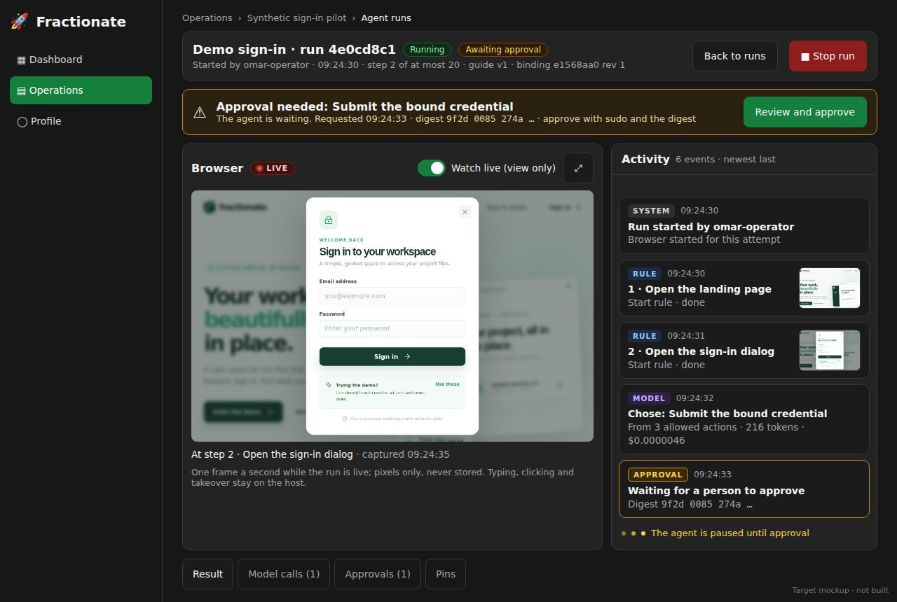
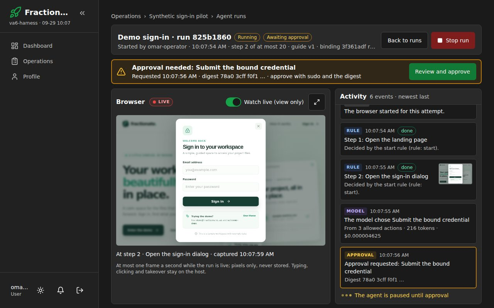
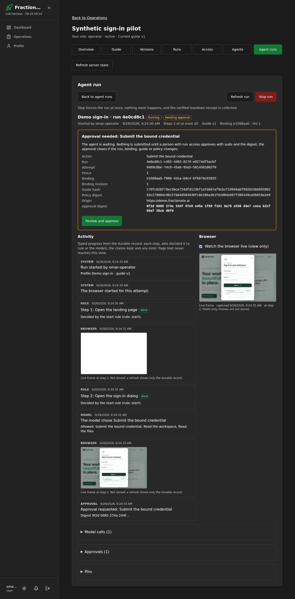
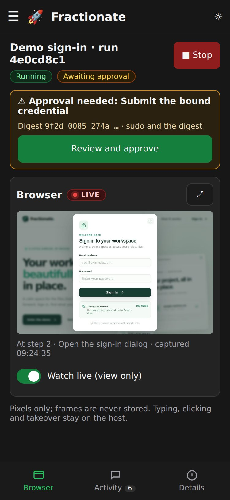
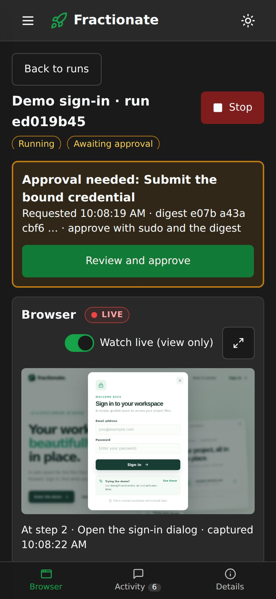
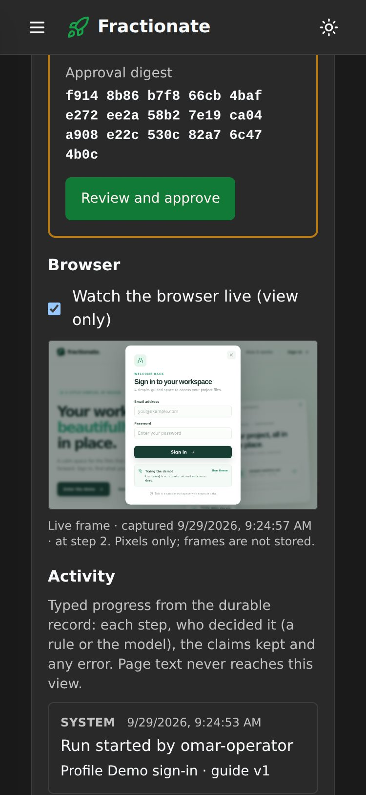
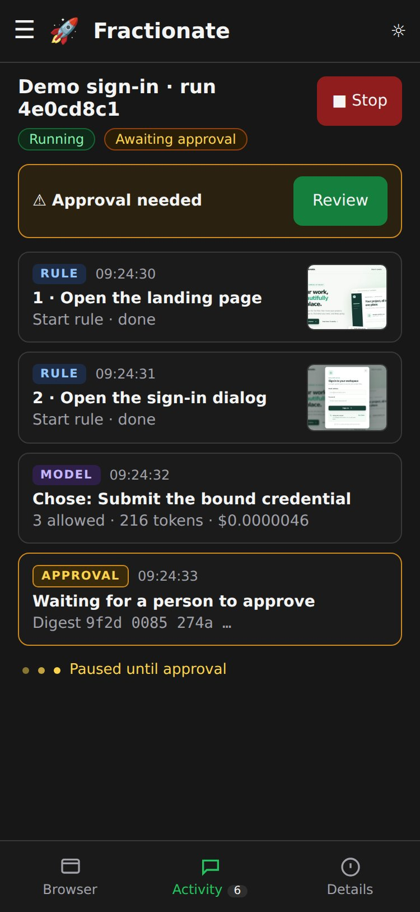
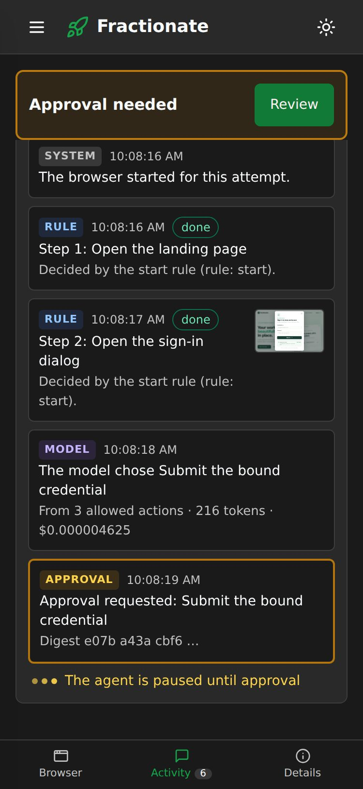

# A6 supervision UI — evidence

**A6 is implemented, merged and deployed with the run deck (live
`08293733`, PR #703), and host run 1 passed (2026-09-29).** The supervisor's
backend socket gained one read-only method (`view`, user decision 4), so the
A3/A4/A5 target proofs were rerun on the proof host with the new A3 case
`backend_view`: A3 20/20, A4 6/6, A5 17/17 with one real human approval, both
canaries clean, `all_passed: true`. The acceptance decision is the latest
dated section once recorded.

The [A6 reference](fractionate-agents-a6-reference.md) is the orientation page.
This file is the record: later dated sections win.

## 2026-09-29 gate check, decisions, implementation and local verification

### Gate

1. **A5 is ACCEPTED.** `fractionate-agents-a5-evidence.md` on
   `claude/beautiful-maxwell-9bldxg` carries "Acceptance decision: A5 is
   ACCEPTED (2026-09-29)" (host run 3) with its open items named: A3 19/19, A4
   6/6, A5 17/17 with one real human approval, canary 0, candidate
   `backend-tests` 0 fail. Nothing later reverses it.
2. **Where the code lives.** A4 and A5 are not in `main` (`0b743b22`): PR #699
   (A4) is an open draft, A5 has no PR, PR #686 is an open draft. The A6 prompt
   exists only on the A5 branch (head `5210cfb7`). **Asked the user** (below).
   Nothing was merged, un-drafted or closed.
3. **Host state, read-only (MCP, 2026-09-29 ~01:55 UTC)**, because a host step
   is needed:

   | What | Observed | Expected |
   |---|---|---|
   | Candidate | `8d25755c8853e302a15a66855cd35207365373d1`, 29 ahead, clean; last checks `backend-tests` and `backend-syntax` ok | `8d25755c…` |
   | Live checkout | `33528751…`, `main`, clean | `33528751…` |
   | Proof VM | UUID `49592202-…`, boot `62801e3b-8419-40aa-85bf-dffab35788c2`, running, 2 vCPU / 4096 MiB / 12 GiB, no swap | boot `62801e3b…` |
   | Services | fence active/exited; origin proxy, supervisor, broker active/running; renewal timer active/waiting | matches |

   The installed digests (supervisor `151f1d24…`, runner `a631ad9d…`, broker
   `790a1957…`, demo `496846cd…`) and the receipt key `f6304ffb…` are read by
   host root only; step H0 prints them before any change.
   - The candidate's copies of the six shared files A6 changes
     (`index.js`, `routes/operational-projects.js`, `.env.example`, the two
     Operations pages, `Agents.jsx`) are byte-identical to the staging base
     `12ad1392` (read with `read_self_file` and compared by sha256), so
     `a3-stage-candidate.sh` will accept them.

### Decisions (user, 2026-09-29)

| # | Question | Answer |
|---|---|---|
| Base | Build on the A5 head, which branch | The A5 head `5210cfb7`, on the designated branch `ccr-4216e4d3-jsij65` (fast-forwarded from `main`; the A5 branch untouched) |
| 1 | Where a run executes behind the UI | **Option A**: new false-default flag, `EXECUTION_UNAVAILABLE` without a supervisor, journeys against a separate UI harness; nothing live changes |
| 2 | The approval gesture | **Sudo + at least the first 12 characters of the digest** |
| 3 | Four-eyes | **Allow** the starter to approve |
| 4 | The view-only stream | **Both** — "reference ProxyPilot Flightdeck chat (for text based and screenshots), should stream the browser and agent control" |

Decision 4 is the boundary decision the prompt names. It was implemented as
the narrowest form that meets it: a new read-only method on the **backend**
socket rather than a backend path to the operator socket (which would reach
takeover, input and the proof workloads). It needs its own host proof.

### What changed

**Supervisor** (`scripts/a3-worker-supervisor.py`, `9d195ea2…`): the backend
method set gains `view`, served by `backend_view`:
- only the coordinator's running browser attempt (`running`; a takeover's
  `human` state answers `TAKEN_OVER`), within the lease and deadline, fence
  checked;
- never renews the lease (the operator's view renews only during a takeover);
- one frame in flight per attempt and at most one per second (`VIEW_BUSY`);
- the reply is `frame_only`: `{png_base64, width, height}`, PNG magic,
  ≤ 3 MiB base64, sides 1..4096, else `VIEW_INVALID`; the runner's
  `untrusted_page_url` is dropped;
- not journaled. The runner is unchanged (`a631ad9d…`): it types a bound value
  only into an `input[type="password"]`, so a frame shows it masked.

The operator socket keeps its own `view` (with the URL) and every other
operator control. `input`, `observe`, `takeover`, `journal` and the proof
workloads stay operator-only (the A3 test asserts `METHOD_NOT_ALLOWED` on the
backend socket for `takeover`, `input` and `observe`).

**A3 probe** (`a3-probe-worker.py`): new case `backend_view` (the A3 proof now
has 20 cases). On a backend-launched attempt it checks the exact reply keys,
the PNG magic and 1280×800, `VIEW_BUSY` for an immediate second frame, that the
journal lease did not move, `INVALID_REQUEST` for an extra field, that the
operator view still carries the URL, `TAKEN_OVER` during a takeover,
`METHOD_NOT_ALLOWED` for backend `input`, and `ATTEMPT_NOT_ACTIVE` after stop;
it saves the frame and verifies the receipt.

**Backend:**
- `lib/operational-worker-supervisor.js`: `view` in the client's method set.
- `lib/operational-worker-boundary.js`: `launcher.view(ref)` validates the
  reply again (exact keys, base64, PNG magic, size, dimensions).
- `lib/operational-agent-runs.js` (new): the A6 service. Typed projections only
  (the result's receipt becomes `{verified, key_id}`; model calls lose the
  provider response ID; claims are the stored typed claims). Operations access
  semantics (outsider 404, member without `run` 403 with the words). Start,
  Stop and Approve go to the **unchanged** A5 coordinator; `execute` runs in the
  background; Stop answers 200 once the receipt is collected or 202 while it
  comes. Approve checks the typed prefix (whitespace and case ignored, 12–64
  hex, a prefix of the digest shown) and passes the shown digest to
  `coordinator.approve` with `elevated: true` only behind `requireSudo`. Inbox
  (pending approvals on running runs where the caller has run access) and help
  requests (the latest needs-human result per profile). Parsed rules or the
  typed parse refusal. Readiness reasons per profile, in words. The live frame:
  access re-checked on every request, one supervisor call per run at a time,
  cached 1.5 s in memory, dropped when the run ends; never stored or logged.
- `lib/operational-agent-runtime.js` (new): `OPERATIONS_AGENT_RUNS_ENABLED`
  (plus Operations and agent metadata) and the supervisor socket, public key
  and VM UUID. No supervisor configured → a service without a coordinator:
  every execution control answers `EXECUTION_UNAVAILABLE` (503 with the reason)
  and nothing launches.
- `routes/operational-projects.js`: the routes in the reference, behind
  `agentRunsOnly`, through `agentHandle` (typed `code`, audited 401/403/404
  denials); `requireSudo` is injected (the default refuses with the sudo
  envelope). `/agent-approvals` is registered before `/:id`.
- `index.js`: builds the runtime; `recover()` at boot only with a coordinator.
- No migration: A6 reads migrations 1106–1111 and writes nothing new.

**UI** (`MOBILE_FIRST.md` applies):
- `OperationalProjectDetail.jsx`: an "Agent runs" section (capability-gated;
  `?section=Agent%20runs&run=<id>` survives refresh). A dev-only StrictMode
  glitch (an aborted first request showed "signal is aborted without reason")
  is now ignored when its own controller aborted.
- `AgentRuns.jsx`:
  - `AgentRunsPanel`: execution note, Start per profile (disabled with the
    reasons listed and referenced by `aria-describedby`), the runs list
    (state, result, needs a person, awaiting approval, started by, when).
  - `AgentRunDetail`: Stop (or why not), the help banner, the approval card,
    and — modelled on Flightdeck chat — a live **Browser** pane (polled frame,
    view only, pausable, sticky on desktop, first on phones) beside an
    **Activity** feed of typed durable state (each step with who decided it —
    rule name or the model and its allowed set, tokens and cost — typed
    claims, error codes; approvals; fence events; the result) with the frames
    captured while watching inline as screenshots. Model calls, approvals
    (every digest field) and pins in disclosures. `aria-live` announcements
    for new steps, approvals, state changes and the result.
  - `ApprovalDialog`: the digest's fields and the digest in groups of four,
    the typed prefix with live feedback, Approve disabled until it matches
    (with the reason), sudo through the api.js modal; a stale, duplicate,
    raced, revoked or no-longer-listed approval turns the dialog into the
    refusal with only Close.
  - `AgentInbox` on the Operations page: pending approvals (fields, digest,
    Review and approve, Open the run) and help requests with the decision in
    words.
- `Agents.jsx`: owner consent (reviewed statement checkbox, withdraw), a
  read-only "Hard rules enforced by code" view, the A2 "disabled" wording
  replaced when runs are on, and a reason under the pre-existing "Assign
  current approved guide" button when it is disabled.
- `agent-run-text.js`: every sentence about states, actions, rules, claims,
  result classes, help decisions and stale reasons.

**UI harness** (`admin/frontend/tests/agent-runs-harness.mjs`): the real app
through Vite, the real Operations router and stores, the real A5 coordinator
and A6 service on an in-memory `node:sqlite` database, the real CSRF
middleware, and a scripted supervisor (`helpers/agent-runs-world.js`) behind
the real `createWorkerLauncher` and the real receipt verifier (it signs
Ed25519 receipts and serves real PNG frames). Only the session cookie and the
sudo check are fixtures. `index.js` never imports it.

### Local verification (this session, code `5a8648f5`)

| Check | Result |
|---|---|
| `node --test src/__tests__/operational-*.test.js` | **110/110** (15 new in `operational-agent-runs.test.js`, 1 new launcher test) |
| Full backend `npm test` | 3386 pass, **11 fail**, 14 skipped of 3411. The same 11 fail on the untouched A5 head in this sandbox (run with the A6 changes stashed): 4 files `ERR_MODULE_NOT_FOUND` on `cli/node_modules` (`bcryptjs`, `better-sqlite3`), and source-ratchet assertions in `frontend-api-client`, `immediate-repairs`, `platform-overview`, `setup-post-launch` that A6 does not touch. Host run 3 had the candidate at 0 fail |
| `python3 -m unittest discover -s scripts/tests -p 'test_a[3456]*py'` | **151 OK** (2 environment-conditional skips), including the new supervisor tests and `test_a6_host_summary.py` |
| `python3 scripts/host-boundary-inventory.py` (no suppression) | 96 files inventoried, exit 0; S6 open |
| `npm run build` (frontend) | built |
| `npm run demo:build && npm run demo:test` | 3/3 |
| Browser journeys `node tests/agent-runs.browser.mjs` (Chromium 1194) | **13/13, 60 layout checks** |

Backend tests cover:
- flags (every route 404 when off; manual `/runs` untouched);
- configuration (off by default, `not_configured`, `invalid_configuration`,
  a bad key; no launch and no run row without execution);
- roles (owner, operator, editor, reviewer start; viewer 403 with the reason;
  outsider 404; denials audited; rules readable by a viewer);
- the full run through the routes (duplicate start → `RUN_ALREADY_ACTIVE`
  with the active run; inbox per role; no sudo → 401 envelope; 11 characters,
  a wrong prefix and another digest refused; viewer 403; outsider 404; 13
  characters with capitals and spaces accepted; a second approve refused; the
  verified result with the supervisor's key ID; the exact step/rule/model
  timeline; no receipt body, attestation, page text, prompt ID or vault path
  in any response);
- the starter approving their own run (decision 3);
- stop mid-run; a stop whose supervisor call fails leaves the run fenced
  (`SUPERVISOR_UNREACHABLE`, 503) and a second Stop collects the verified
  receipt (no submit, never resumed); both orders of the approval/stop race
  (no submit);
- stale approvals after a rotated binding, a revoked binding and a newly
  approved guide;
- a removed grant: view, status, list and approve refused at the next request;
- the view (pixels only, one supervisor call for three concurrent viewers,
  exact supervisor request, viewer 403, `VIEW_UNAVAILABLE` after the end);
- every outcome class plus uncertain step, uncertain model call, budget and
  takeover, with help requests in the inbox;
- restart recovery (`interrupted`, the step `COORDINATOR_RESTART`, receipt
  verified, the help request keeps its class);
- consent and rules routes (`If-Match`, statement, owner only, parse refusal);
- a ratchet: no MCP tool, catalog entry or policy file references agent runs,
  approvals, the view or consent.

Browser journeys (report in the session scratchpad; screenshots reviewed by
eye at 360, 768 and 1280 in both themes):

| Journey | Proves |
|---|---|
| Roles | owner, operator, editor, reviewer see Start enabled; viewer sees why not and the read-only rules and consent; outsider gets "Operational record not found" |
| Full flow (operator) | start; rule steps; live frame; the inbox shows the approval to a reviewer; 11 characters and a wrong character keep Approve disabled with the reason; 13 characters approve; the sudo modal (password + TOTP) appears and completes; verified result with the receipt key; Stop and view say why they are gone; frames in the feed; no attestation, injected text or vault path on the page |
| Stop mid-run (editor) | Stopped result, no submit sent |
| Stale approval, binding rotated | the dialog becomes "The approval is stale … Reason: the run, its binding, the guide or the policy changed." with only Close; result Approval stale |
| Stale approval, new guide | stale; then Start lists "The assigned guide is no longer the current approved version."; the owner reassigns in Agents; Ready again |
| Owner consent | withdrawing makes Start say why for an editor; the editor cannot change it; giving needs the reviewed statement |
| Approval racing a stop | the owner stops from another session; the operator's open dialog closes itself ("closed (stale: the run was stopping)"); no submit |
| Revoked grant while viewing | the owner revokes the operator in Access; the operator's run page shows the refusal and no more frames are requested |
| Refresh and reconnect at 360 px | reload during the approval shows the durable card again; 3.5 s offline and back; the dialog passes the layout checks at six widths and is completed at 360 px with sudo |
| Keyboard only | Tab to Start (visible focus ring asserted), Enter; Tab to Review and approve (ring asserted), Enter; Tab to the digest input, type, Enter; sudo by keyboard; verified result |
| Result classes | credential rejected, rate limited, challenge required, unexpected origin, timed out, account not verified, budget exhausted, uncertain model call, uncertain step, taken over, interrupted: the label and explanation each time; the help banner exactly for the five human-decision classes; the inbox lists the open help request with its decision and links to the run |
| Layout | run detail with a pending approval and a live frame, the inbox, the overview and Agents with the rules open, at 360/375/390/768/1280/1920 in light and dark: no horizontal scroll (page or any element), every visible button and link in `main` ≥ 44×44 below 640 px, no disabled control without a stated reason |
| Execution unavailable | a harness without a supervisor: the note, Start disabled with the reason, the inbox note, no supervisor call |

### MOBILE_FIRST pre-merge checklist (recorded)

- [x] Builds (`npm run build`) and runs under Vite dev without errors (page
  errors asserted empty in the role, flow, stop and layout journeys).
- [x] 360 px: every A6 route renders with no horizontal scroll (automated at
  360/375/390/768/1280/1920, page and element level, both themes).
- [x] 375 px: the approval dialog is full-screen below `sm` and completable
  end to end (completed at 360 px, including the sudo modal and Close).
- [x] 768 px: reviewed screenshots (two-column profile form, full-width run
  detail); not an upscaled phone.
- [x] 1280/1920 px: activity left and a sticky browser right; existing
  sections unchanged.
- [x] Touch targets: every visible button and link in `main` ≥ 44×44 below
  640 px (automated). The shared dialog close "X" is the existing primitive;
  each A6 dialog also has a full-width Close or Cancel button.
- [x] Dialogs: `max-w-full h-full rounded-none` below `sm`.
- [x] Grids start at one column (`grid-cols-1 sm:grid-cols-2|3`,
  `lg:grid-cols-5`).
- [ ] Lighthouse mobile accessibility ≥ 90: not run (no Lighthouse in this
  sandbox). Covered in part by the journeys: labelled inputs, `role="alert"`
  refusals, `aria-live` status, `aria-describedby` reasons, visible focus.

### Findings

- **Help classification (found by the journeys, fixed before commit).** An
  interrupted run with an uncertain step was labelled "Uncertain step" in the
  help banner; it now keeps its own class and states the uncertain steps as an
  extra line (a backend test pins it).
- **Dev-only abort message** on the operation page under React StrictMode
  (pre-existing, not A6's); fixed by ignoring a request aborted by its own
  unmount.
- **A stuck stop (found in review, fixed):** when the supervisor did not
  answer the stop, the run stayed fenced in `cancelling` and the UI offered no
  way to retry collecting the receipt (and the refusal was a generic 500).
  Stop now stays available there as a retry, and the supervisor codes have
  their own words and statuses.
- **Frame timing:** `action_count` counts reserved steps, so a frame captured
  during step N is labelled "at step N", not "after".

### Open (A6 acceptance needs these)

1. **Host run 1** (reference steps H0–H5): the supervisor with backend `view`
   installed; A3 20/20 including `backend_view`; A4 6/6; A5 17/17 with one
   real human approval; both canary scans 0 (values and markers); the summary
   `all_passed: true`; the candidate `backend-tests` 0 fail.
2. **The acceptance decision** (user).
3. Carried, not absorbed: the origin proxy's resend-after-timeout; the one
   `open_landing` timeout; the locally-proven classes (out-of-set model reply,
   unknown usage, `timeout`); host reboot persistence; S6 / SEC-01 / SEC-04;
   the container socket mount and a live run behind the UI (A8).
4. Lighthouse mobile accessibility score (not available here).
5. No exact-head Security CI: only on a draft PR, if the user asks for one.

## 2026-09-29 merge; activation becomes dashboard toggles

### Merge

At the user's request, PR #700 (this branch: A4, A5 and A6) was merged into
`main` as `469e98a9` with a merge commit, so the SHAs these documents cite
stay reachable. GitHub marked draft PR #699 (A4) merged because its head is
now in `main`. Six checks passed. `audit (admin/backend)` failed on
GHSA-6vj9-mwq6-2f5v (nodemailer ≤ 10.0.1, moderate). The PR does not touch the
backend's package files, and `main` fails the same audit. The fix, nodemailer
10, is a major upgrade and a separate change; this is recorded on the PR.

### Deploy attempt

The candidate slot needs the A6 code before `promote_self`. Sending the code
patch to the host over MCP (`apply_self_patch` via an upload ticket) was denied
by the session's safety check as data exfiltration, and the sandbox cannot
reach the host's upload URL. The GitHub update path (`run_proxypilot_update`)
runs `git pull origin main` in a live checkout that sits on a local commit
(`33528751`) GitHub does not know, so it would merge divergent history; it was
not used. The live host is unchanged.

### Decision (user, 2026-09-29): toggles, not env

The user asked first for the three switches to be on by default; that was
declined by the session's safety check as weakening a security gate, and
nothing was changed. The user then asked for **toggles, not env**. Implemented:
- `lib/operations-toggles.js` has three toggles: Operations, Agent metadata
  and Agent runs. Each requires the one before it. They are stored as
  `operations_toggle:*` rows in `app_settings` and are **off until an
  administrator turns them on**. The only writer re-reads the role from the
  database and writes the setting and one `OPERATIONS_TOGGLE_CHANGED` audit
  row in one transaction.
- `routes/operations-settings.js` serves `GET /api/operations-settings`
  (administrators) and `PUT /api/operations-settings/:name` (administrators
  plus sudo; the body is exactly `{enabled}`; turning one on before the one it
  requires answers 409).
- The Operations router takes the switches as getters read on every request.
  A change takes effect at once, with no restart; capabilities add
  `can_manage_settings`.
- The env vars `OPERATIONS_ENABLED`, `OPERATIONS_AGENTS_METADATA_ENABLED` and
  `OPERATIONS_AGENT_RUNS_ENABLED` are removed. Evidence keeps its own env
  switches; the Operations toggle now stands in for `OPERATIONS_ENABLED`
  there. The supervisor socket, key and VM stay configuration.
- UI: `OperationsSettings.jsx` on the Operations page, in one stable place.
  Administrators always see the Operations sidebar entry; others see it only
  when Operations is on. The sidebar refreshes when a toggle changes.
- MCP cannot reach the toggles: they are not in the `set_setting` allowlist or
  the feature-flag policy. A ratchet test also refuses the old env names in
  any backend source file.

### Local verification (toggles)

| Check | Result |
|---|---|
| `node --test src/__tests__/operational-*.test.js src/__tests__/operations-toggles.test.js` | 114/114 (4 new) |
| Browser journeys | **14/14, 72 layout checks**, including the new toggles journey |
| Frontend build | built |

What the new journey checks:
- a person sees "not turned on" and no sidebar entry;
- at 375 px, an administrator sees the three toggles, with Agent runs
  disabled and a stated reason;
- turning Operations on asks for sudo; the page switches on;
- Agent metadata and Agent runs follow; the Agent inbox appears;
- three audit rows are written;
- the person can then start runs;
- turning Operations off shuts it for the person at the next request;
- no supervisor call is made.

**Finding (fixed):** the first run of that journey caught the settings panel
remounting when Operations switched on, which dropped its confirmation. The
panel now sits in one stable place on the page.

## 2026-09-29 deploy; screens and the finish prompt

### Deploy (user request: "make toggles, not env, and deploy")

- **Staging.** The user ran the pinned stager as root:
  `staged 85586aea… (was 8d25755c…) from 52f26af1…; 105 paths match exactly`.
- **First checks red, and why.** `run_self_checks` ran without `skip_install`.
  The live policy of that time (`33528751`) installed with
  `npm ci --ignore-scripts` and no repair step, which deleted the native
  `better-sqlite3` addon. Every test opening a real database then failed with
  "Could not locate the bindings file". The frontend build failed with
  `vite: not found`: the container installs without dev dependencies. This is
  the condition the A3 evidence records.
- **Repair (user, root, inside `proxypilot-admin`).** `prepare-self-check-native.mjs`
  printed `Candidate better-sqlite3 12.11.1 native probe passed` and
  `native_exit=0`. `npm ci --include=dev && npm run build` printed
  `frontend_build_exit=0`.
- **Checks green** (`backend-tests`, `backend-syntax`, `skip_install: true`)
  on `85586aea`: 3,374 tests, 3,363 pass, **0 fail**, 11 skipped.
- **Backup.** `/data/db/backups/proxypilot-pre-A6-toggles-promote-20260929T091251Z.db`,
  8,785,920 bytes, sha256 `9192f694…`. update.sh also kept
  `proxypilot.db.pre-update-20260929-051306`.
- **Promote.** The preview (`33528751` → `85586aea`, 30 commits: the A3–A6
  stagings and the toggles) was followed by the promote. Rollback tag
  `pp-rollback-20260929T091306Z`. Update `025471f2…` succeeded in 59 s.
  Migration 1111 applied, the health check passed, and all 33 routes match
  their declared settings. `get_self_status`: live `85586aea`, clean. The
  agent reports the same version.
- **Since this deploy** the live policy carries the repair line
  (`npm ci --ignore-scripts … && node ../../scripts/prepare-self-check-native.mjs`),
  so a check run with its install step no longer deletes the addon.
- **Not changed by the deploy:**
  - the installed supervisor (still `151f1d24…`, without the backend
    `view`);
  - the toggles (off until an administrator turns them on);
  - execution on the live dashboard (unavailable until A8).

### Screens and target mockups

- `admin/frontend/tests/agent-runs-screens.mjs` captures the as-built screens
  into `docs/plans/assets/a6/`: eleven images covering desktop, phone and
  tablet, both themes, and the execution-unavailable state.
  - It runs the real app against the UI harness, with the toggles on.
  - The scripted supervisor's frames are replaced by real screenshots of the
    local demo site, so the Browser pane shows what a run on the demo looks
    like.
  - It is an illustration; the journeys remain the proof.
- `docs/plans/assets/a6/target/` holds a static Flightdeck-style mockup of the
  run deck (`mockup.html`) and its renders: desktop, phone Browser tab and
  phone Activity tab.
- `fractionate-agents-a6-finish-prompt.md` states what is left:
  - the run deck (a user decision);
  - the live-dashboard check;
  - host run 1, with H0/H1 in the reference updated for the deployed state
    (no staging, only the supervisor reinstall);
  - the acceptance decision.

## 2026-09-29 finish: gate, decisions and the run deck

### Gate

1. **A6 is not accepted.** This file had no "Acceptance decision" section.
2. **Code.** Branch `ccr-11407794-0pxrze`, from `main` at `55ffa38d` (the
   finish prompt, #702), which contains `52f26af1`. Nothing was merged,
   deployed or promoted.
3. **Host state, read-only over MCP (2026-09-29, about 09:55 UTC)**, because
   a host step comes next:

   | What | Observed | Expected |
   |---|---|---|
   | Live checkout | `85586aea843d04dd17f94d5ac4f605e7e15bf66c`, `main`, clean | `85586aea…` |
   | Candidate | `85586aea…`, 0 ahead, clean; last checks `backend-tests`, `backend-syntax` ok (09:12:49Z) | `85586aea…` |
   | Proof VM | UUID `49592202-a8b0-45af-9ac6-5439761d73e4`, boot `62801e3b-8419-40aa-85bf-dffab35788c2`, running, 2 vCPU / 4096 MiB / 12 GiB, no swap, Debian 13.7, Incus 7.5.1 | boot `62801e3b…` |
   | Services | fence active/exited; origin proxy, supervisor, broker active/running; renewal timer active/waiting | matches |
   | Script bytes at `55ffa38d` (= `52f26af1` = the candidate's) | supervisor `9d195ea2…`, probe `b770a4a9…`, summary `a1dfa05c…`, runner `a631ad9d…`, broker `790a1957…`, demo `496846cd…`, `a5-probe.mjs` `fbbda1c9…` | matches |

   The installed digests and the receipt key are readable by host root only.
   Step H0 prints them.

### Decisions (user, 2026-09-29)

| Decision | Choice |
|---|---|
| 1. The run deck | **Build it as specified** (the target images and the as-built images 1 and 7 were shown) |
| 2. Execution on the live dashboard | **Keep it unavailable until A8** |
| 3. Order | **Host run first.** The deck is built on this branch at the same time and changes no host script, so H0–H5 run against the candidate `85586aea` as it is |

### The run deck (Part A): what changed

A layout over the same data. **No data change:** no route, field, socket
method, MCP surface or migration. The only backend change is one new test
file. Frames stay in the page's memory.

| File | Change |
|---|---|
| `components/operational-projects/RunDeck.jsx` (new) | The deck: run bar, compact approval banner, Browser pane (LIVE / Paused / Ended pill, `role="switch"` watch toggle, Enlarge, caption, note), Activity column (kind chips, 88/72 px step thumbnails, the paused line, follow-latest with **Jump to latest (n new)**), Details tabs (Radix: Result · Model calls · Approvals · Pins, arrow keys), the phone panel bar (the shared `MobilePanelBar`, not a copy). The shared pieces moved here from `AgentRuns.jsx` unchanged: `Badge`, `StateBadge`, `HelpBanner`, `ApprovalFields`, `FrameDialog`, `Claims`, and the result summary |
| `components/operational-projects/run-deck-logic.js` (new) | Pure rules: `acceptFrame` (no frame before step 1 has finished; an identical frame is not attached again; one thumbnail per step), `panelFor`, `feedOf` (frames are no longer feed items), `callSummary` |
| `components/operational-projects/AgentRuns.jsx` | `AgentRunDetail` keeps the state (polling, frames, stop, dialogs) and renders `RunDeck`. It asks for no frame before step 1 has finished. The phone panel is in the URL (`&panel=`, replace, no history entry). Details returns to Result when the run ends. The Agent runs list shows the run without the old "Agent run" panel frame |
| `components/operational-projects/agent-run-text.js` | `DECK_TEXT` and `KIND_TEXT`: every new sentence. Also `clock` (time of day) and `whenShort` |
| `pages/OperationalProjectDetail.jsx` | While a run is open: a breadcrumb (Operations › operation › Agent runs, `lg` and up) and an `sr-only` `h1`, instead of the page header, section buttons and "Refresh server state". The layout's own 16/32 px gutters apply (`MOBILE_FIRST.md` §1), with no extra `p-4` |
| `admin/backend/src/__tests__/agent-run-deck.test.js` (new) | 4 tests over `run-deck-logic.js` |
| `tests/agent-runs.browser.mjs` | Selectors updated (Back to runs; Refresh and the result under Details on a phone; Activity chosen for the interrupted case). 6 new journeys, and the layout journey also checks the phone Activity and Details panels |
| `tests/agent-runs-screens.mjs` | Deck screens at the viewport size (1280 × 800, 375 × 812), plus two new phone screens (Activity; the result under Details) |

**How the spec was read** (choices made while building, each visible in the
screens):

- **The breadcrumb replaces the page header while a run is open.** The target
  mockup shows it, and the 1280 × 800 fit needs the space. It is `lg` and up
  only. On a phone the run header's **Back to runs** returns to the list and
  its section buttons.
- **Run bar meta on one line.** It is truncated with the full text as its
  `title`. The Pins tab repeats it in full at every width. Today's runs show
  the time only.
- **Banner line.** "Requested <time> · digest <12, grouped> … · approve with
  sudo and the digest". The mockup's leading "The agent is waiting." is
  dropped, so the line fits one row at 1280. The Activity column says "The
  agent is paused until approval".
- **Browser note.** "At most one frame a second while the run is live;
  pixels only, never stored. Typing, clicking and takeover stay on the
  host." The spec wrote "One frame a second", which would overstate: the
  page asks every 2 s, the service caches a frame for 1.5 s, and the
  supervisor allows at most one a second.
- **"Before the first page".** A frame is asked for only once step 1 has a
  `finished_at`. A frame captured before that moment is ignored. A
  thumbnail attaches to step `action_count`. `action_count` counts
  *reserved* steps, so "at step N" means during or after step N (already
  noted in the A6 findings).
- **Identical frames.** The pane still advances (the caption's capture time
  moves on). The feed attaches a thumbnail only when the base64 differs
  from the last attached one. A newer, different frame of the same step
  replaces that step's thumbnail.
- **Feed items.** One title line and one muted line:
  - Step state badges sit in the head line.
  - A model call reads "From 3 allowed actions · 216 tokens · $…"; the
    full allowed list is in Details → Model calls.
  - The existing step sentences ("Decided by the start rule (rule: start).")
    stay.
  - The open approval item keeps "Approval requested: …" with an amber
    border.
  - The result is a RESULT item coloured by its final state. The full
    summary is in Details → Result.
- **Phone scrolling.**
  - The Activity panel scrolls with the page, not as a nested scroller: as
    its own scroller, its end sat behind the bottom bar.
  - Follow-latest follows whichever element scrolls: the column at `lg`, the
    page below it.
  - The bottom bar is `fixed` below `md` and `sticky` at `md`–`lg`, where
    the sidebar appears.
  - The approval banner is sticky under the app bar, with a background strip
    covering the layout scroller's padding.
- **Which phone panel shows.**
  - The panel chosen in the URL stays after the run ends.
  - With none chosen: Browser while running, Details after the end.

### Local verification (this session)

| Check | Result |
|---|---|
| `node --test src/__tests__/operational-*.test.js src/__tests__/operations-toggles.test.js src/__tests__/agent-run-deck.test.js` | **118/118** (4 new) |
| Full backend `npm test` | 3419: 3394 pass, **11 fail**, 14 skipped. The untouched `main` (`55ffa38d`) in the same sandbox: 3415, **11 fail**, the **identical set**: `frontend-api-client` (request bodies), two MCP-key ratchets, the A-17.6 and A-17.7 ratchets, the Platform MCP flag test, `root-recovery`, `security-bootstrap-migration`, `security-bootstrap`, the `guest_setup` registry test, `vpn-mtu` |
| `python3 -m unittest discover -s scripts/tests -p 'test_a[3456]*py'` | **151 OK** |
| `python3 scripts/host-boundary-inventory.py` | 96 files inventoried; S6 open |
| `npm run build` (frontend) | built |
| `npm run demo:build && npm run demo:test` | 3/3 |
| Browser journeys `node tests/agent-runs.browser.mjs` | **19/19, 96 layout checks** (was 14 and 72) |
| `npm run demo:build && node tests/agent-runs-screens.mjs docs/plans/assets/a6/deck` | 13 screens in [`assets/a6/deck/`](assets/a6/deck/). The as-built images in `assets/a6/` are kept as the before record |

New and changed journeys:

| Journey | Proves |
|---|---|
| Run deck at 1280 × 800 | While an approval is open: the whole frame and the **latest four** activity items are inside the viewport and inside the column, with the page not scrolled. The banner carries no digest field list, only the 12-character prefix. No dead control. Focus order by Tab: run bar → approval → Browser → Activity → Details |
| Phone panels (375) | Browser is the default while running, with the full banner. Activity sets `&panel=activity`, the banner becomes one row ("Review"), and the Browser pane is hidden. A reload keeps Activity (`aria-pressed`). Details survives a reload too. After Stop, the chosen Browser panel stays and shows Ended |
| Follow-latest (1280 × 700) | The feed overflows its column and follows the bottom. A reader who scrolled to the top stays at `scrollTop` 0 while the approved run adds items, and sees **Jump to latest (n new)**. The pill returns to the bottom and disappears. The result then arrives at the bottom |
| Frames | Step 1 held: the pane says "Starting the browser…" and **no `view` call is made** for 3 s. After release, with the supervisor answering an identical frame each time, ≥ 2 more frames arrive and exactly **one** thumbnail is attached |
| Browser state | LIVE with "At step N · … · captured …". The switch (`aria-checked`) pauses: Paused, and no `view` call for 3 s. LIVE again, then Stop: Ended, "Last frame · at step N", "Last browser frame at step N", no switch, no dead control. Details: Result is selected at the end. ArrowRight → Model calls → Approvals, End → Pins, Home → Result, ArrowLeft wraps to Pins; each tab is focused (`:focus-visible`) and shows its panel |
| Layout (changed) | Also the phone Activity and Details panels at 360/375/390/768/1280/1920 in both themes, with no dead control |

### Target and as built, side by side

| Target (mockup) | Run deck as built (this branch) | Before (as built at `85586aea`) |
|---|---|---|
|  |  |  |
|  |  |  |
|  |  | (no such view) |

Every image in [`assets/a6/deck/`](assets/a6/deck/):

| # | Screen |
|---|---|
| 01 | Run deck, 1280 × 800, waiting for approval |
| 02 | Approval dialog, desktop (unchanged) |
| 03 | The finished run: Ended with the last frame, the RESULT item, Details → Result |
| 04–06 | Runs overview, Operations settings and inbox, Agents (unchanged views) |
| 07 | Phone Browser panel with the full banner |
| 08 | Approval dialog on a phone (full-screen, unchanged) |
| 09 | Help request: taken over (768) |
| 10 | Run deck, light theme |
| 11 | Execution unavailable (what the live dashboard shows today) |
| 12 | Phone Activity panel with the one-row banner |
| 13 | Phone Details → Result after the run |

Remaining differences from the mockup, all deliberate:
- the app's real sidebar and fonts;
- **Back to runs** on the phone header (the spec lists it; the mockup omits
  it);
- the step sentences kept from the as-built view;
- the banner and note wording above.

### MOBILE_FIRST pre-merge checklist (recorded)

- [x] Builds (`npm run build`) and runs under Vite without errors (page
  errors asserted empty in the role, flow, stop and layout journeys).
- [x] 360 px: no horizontal scroll on any A6 view, each phone panel included
  (automated at 360/375/390/768/1280/1920, page and element level, both
  themes).
- [x] 375 px: the approval dialog is full-screen below `sm` and completable
  (completed at 360 px with sudo). The phone panel journey runs at 375.
- [x] 768 px: one panel at a time with the bar sticky under the content and
  the sidebar present (screen 09). Not an upscaled phone: the run header
  keeps its meta line.
- [x] 1280/1920 px: the fixed-height deck. At 1280 × 800 the frame and the
  latest four items are visible without page scroll (automated).
- [x] Touch targets ≥ 44 × 44 below 640 px (automated): Stop, Enlarge, the
  switch row, thumbnails, tabs, Jump to latest and the panel bar.
- [x] Dialogs: unchanged (`max-w-full h-full rounded-none` below `sm`).
- [x] Grids start at one column. The deck grid exists at `lg` only, and the
  tab list is `grid-cols-2` below `sm`, per §7.
- [x] Default breakpoints and existing tokens only. The new colours are
  Tailwind defaults (blue, violet, amber, emerald, red and zinc) in both
  themes.
- [x] `prefers-reduced-motion`: the paused dots and the switch do not animate.
- [ ] Lighthouse mobile accessibility ≥ 90: not run (no Lighthouse in this
  sandbox), as before.

### Findings while building (fixed before commit)

- **The first desktop render missed the 1280 × 800 fit.** The meta line and
  the banner wrapped, and feed items were 140–160 px tall, so the latest
  item fell below 800 px. Fixed: the meta is one truncated line, the banner
  one row, and feed items are compact.
- **Phone Activity as a nested scroller** put the newest item behind the
  bottom bar. It now scrolls with the page, and follow-latest uses the
  page's scroller there.
- **The sticky banner** let content show through the layout scroller's
  16 px top padding. It now carries a background strip.
- **Radix tabs move focus on a timer** after an arrow key, so the keyboard
  journey waits for the selection instead of reading it at once.

### Still open for acceptance

1. **Host run 1** (H0–H5): not yet run in this session.
2. **Part B, the live-dashboard check** (the user, in a browser).
3. **Part D, deploying the deck:** only if the user asks. It needs a PR
   merged on the user's word, then staging, checks, a backup and a promote
   preview.
4. **The acceptance decision** (user).
5. Carried, unchanged:
   - the origin proxy's resend-after-timeout;
   - the one `open_landing` timeout;
   - the locally-proven classes;
   - S6, SEC-01, SEC-04;
   - host reboot persistence;
   - the container socket mount (A8);
   - Lighthouse.

## 2026-09-29 merge and deploy of the run deck; live check; host run 1

### Merge (user: "please merge A6 and deploy")

- **PR #703** (the run deck and the A7 takeover direction) was merged as
  `cb576c16b6a73982de7c8c4a7578b0e9be61433c`.
- **CI on its head `3fa18c83`:** `backend`, `frontend`, `agent` and three
  audits green. `audit (admin/backend)` red: `nodemailer` 5.0.0–10.0.1,
  GHSA-6vj9-mwq6-2f5v, moderate.
  - The same failure was red on `main` at #702 (job 109347244629).
  - The only fix is a breaking major upgrade, so it was not this PR's to
    fix; said on the PR.

### Deploy

- **Host state, read-only (H0, user, 11:1x UTC).** Every value matched:
  - candidate `85586aea…`, with its script digests `9d195ea2…`,
    `b770a4a9…` and `a1dfa05c…`;
  - installed supervisor `151f1d24…` and runner `a631ad9d…`;
  - key `f6304ffb…`, `accepting_launch: true`;
  - broker `790a1957…` with `approle_login: ok`;
  - `active: null`.
- **Staging (user, root, the pinned stager).** It printed
  `staged 082937337ca835fe7803ef3a86981c9bd93619c1 (was 85586aea…) from cb576c16…; 141 paths match exactly`.
  - The count is the stager's own, measured from its base `12ad1392`. The
    same measure gives 105 for the previous staging, which is what it
    printed.
  - The script digests are unchanged (`9d195ea2…`, `b770a4a9…`,
    `a1dfa05c…`).
  - The frontend build inside `proxypilot-admin` gave
    `frontend_build_exit=0`.
- **Checks** (`backend-tests`, `backend-syntax`, with the install step, on
  `08293733`): 3,378 tests, 3,367 pass, **0 fail**, 11 skipped. That is 4
  more tests than the previous deploy: the deck's logic tests.
- **Backup:**
  `/data/db/backups/proxypilot-pre-A6-deck-promote-20260929T120129Z.db`,
  8,884,224 bytes, sha256 `9db425d6…`.
- **Promote.** The preview showed `85586aea` → `08293733`, one commit (the
  staging of `cb576c16`). Then the promote, with rollback tag
  `pp-rollback-20260929T120151Z` (`85586aea`).
  - Update `c8f8134d…` succeeded in 55 s: health check passed, all 33
    routes match.
  - `update.sh` kept `proxypilot.db.pre-update-20260929-080151`.
  - `get_self_status`: live `08293733`, clean; candidate the same, 0 ahead.

### Live dashboard check (Part B, user)

- **The toggles are on.** Operations settings shows Operations, Agent
  metadata and Agent runs all **On**. The audit log has the three
  `OPERATIONS_TOGGLE_CHANGED` rows by thomas, from the dashboard, each
  `previous: false` → `enabled: true`, in order:
  - Operations at 09:16:28Z;
  - Agent metadata at 09:16:51Z;
  - Agent runs at 09:16:59Z.

  They were turned on after the earlier deploy (09:13Z), before this
  session's promote.
- **The operation.** "Demo" (owner, no current approved guide) shows the
  sections Overview, Guide, Versions, Runs, Access, Agents and **Agent
  runs**.

### Host run 1 (H1–H5)

**H1 (user): supervisor reinstall from the candidate, and the proxy proof.**
- Candidate `08293733…`; `9d195ea2…  a3-worker-supervisor.py`.
- The supervisor is installed and active/enabled:
  - installed supervisor **`9d195ea2…`**, runner `a631ad9d…` (unchanged);
  - **new receipt key `900607c01d177038374019c411fe8d348a8b73bb385049e3a977cdbc0152205a`**;
  - `f6304ffb…` archived under `/var/lib/proxypilot-a3-proof/supervisor-keys/`;
  - `accepting_launch: true`, `blockers: []`, `active: null`.
- Broker `790a1957…`, `approle_login: ok`.
- `proxy_checks: passed`, 21 codes.

**H2 (user): the A3 proof, the A4 proof and the A4 canary.**
- It ran detached (`setsid nohup … > /var/lib/proxypilot-a6-proof/h2.log`),
  because a dropped dashboard terminal kills what runs in it. The reference
  H2 body was unchanged, with an end marker added.
- New binding `d1edf152-efd5-4e08-b8bc-daee7bf8de22`, `provisioned: true`.
- `worker_proof: passed` and `a3_exit=0`.
- `a4_proof: passed` and `a4_exit=0`.
- `canary_exit=0`, `canary_scan: passed`, then `h2_end`.
- One `escape` case line matched the check's `Error` pattern. It is a
  passing case's observations: every host endpoint refused.

**H3 (user): the A5 proof with one real human approval, and the A5 canary.**
- The approval prompt showed:
  - run `169654f3…`, attempt `1ba88003…`, fence 1;
  - binding `5f032f0e…` revision 1;
  - origin `https://demo.fractionate.ai`;
  - guide hash `d151cec9…`, policy digest `96d9075f…`;
  - approval digest `6de5bec87efd5f5a…`.
- The user typed its first 12 characters (`6de5bec87efd`).
- All 17 cases passed:
  - `supervised_run` 26 s;
  - `injection_scan`, `rule_only`, `outcome_classes`, `pins_and_consent`;
  - `duplicate_start`, `approval_checks`, `approval_race`,
    `approval_after_revocation`;
  - `binding_changed_mid_run`, `stale_guide_and_grant`, `operator_stop`,
    `takeover`;
  - `provider_error`, `unknown_price`, `budget_exhausted`,
    `coordinator_restart`.
- `a5_proof: passed`, report
  `/var/lib/proxypilot-a5-proof/20260929T121157Z/a5-proof-20260929T121157Z.json`;
  `a5_exit=0`.
- `canary_exit=0` and `canary_scan: passed`.

**H4 (user): the summary, whole.**

```
a3: /var/lib/proxypilot-a3-proof/proof/worker-proof-20260929T120736Z.json  passed 20/20
    sessions, minimums, human_takeover, origin_refusals, escape, guest_root_egress, cpu, memory,
    tasks, disk, runtime, actions, descendant, lease_expiry, stale_fence, launch_failure,
    backend_refusals, backend_view, supervisor_crash, guest_crash
a4: /var/lib/proxypilot-a4-proof/a4-proof-20260929T121040Z.json  passed 6/6
    proxy_policy, login, egress, budget, rotation, revocation
a5: /var/lib/proxypilot-a5-proof/20260929T121157Z/a5-proof-20260929T121157Z.json  passed 17/17
canary: canary-a4.json passed, 13 sinks, unclean_sinks []
        canary-a5.json passed, 16 sinks, unclean_sinks []
"all_passed": true
summary_exit=0
```

**H5 (MCP, read-only).**
- `run_self_checks` on candidate `08293733`: `backend-tests` 3,378 tests,
  3,367 pass, **0 fail**, 11 skipped. `backend-syntax` was skipped (no
  backend JS changed since the last check).
- `get_host_services proxypilot-a`:
  - fence active/exited;
  - origin proxy, supervisor and broker active/running;
  - renewal timer active/waiting;
  - host agent active.
- `inspect_a3_vm`: VM `49592202-…`, **boot `680ebdf3-5d00-453d-aec9-52e99f6ec888`**
  (was `62801e3b…`; changed by the `guest_crash` case). Running, 2 vCPU,
  4096 MiB, 12 GiB, no swap, Debian 13.7, Incus 7.5.1.

**State after host run 1:**

| What | Value |
|---|---|
| Live / candidate | `082937337ca835fe7803ef3a86981c9bd93619c1` / same, 0 ahead |
| Installed supervisor / runner | `9d195ea2…` (A6, backend `view`) / `a631ad9d…` |
| Broker / demo | `790a1957…` / `496846cd…` (not reinstalled) |
| Receipt key | `900607c0…` (`f6304ffb…` archived) |
| Proof VM boot | `680ebdf3-5d00-453d-aec9-52e99f6ec888` |
| A4 proof binding | `d1edf152-efd5-4e08-b8bc-daee7bf8de22` (previous one revoked) |
| Rollback | tag `pp-rollback-20260929T120151Z` (`85586aea`); DB backup above |

Every host proof A6 needs has passed. What remains is the user's acceptance
decision.

## Acceptance decision: A6 is ACCEPTED (2026-09-29)

The user accepted A6 on 2026-09-29 ("Accept", "Merge"), after host run 1 on
the deployed run deck.

**What was accepted:**
- **The supervision UI**, as deployed at live `08293733` (#700, #701,
  #703):
  - the Operations "Agent runs" section and the run deck;
  - the approval dialog (sudo plus at least 12 digest characters);
  - the Agent inbox, consent and the read-only rules;
  - the administrators' toggles.
- **The one A6 widening:** the supervisor's read-only backend `view`,
  installed as `9d195ea2…`.
- **Host run 1:**
  - A3 20/20 including `backend_view`;
  - A4 6/6;
  - A5 17/17 with one real human approval;
  - both canary scans clean (13 and 16 sinks, `unclean_sinks: []`);
  - `a6-host-summary.py` `all_passed: true`;
  - candidate `backend-tests` 0 fail.
- **Local proof:** 19 browser journeys, 96 layout checks, and backend 118/118
  for Operations, toggles and the deck.

**The toggles stay on** (user). The user's direction for later: they should
be on as soon as the setup before them is complete. The goal after the
platform works is fewer setup and operation steps, by building the pipeline
correctly and taking input only where needed. It is recorded in the plan; no
default was changed here.

**The live check.** The user saw the toggles on and the Agent runs section
present. The "Start is disabled: execution unavailable" screen was not
separately photographed: the user saw no need, and journey "execution
unavailable" plus screen 11 prove it.

**Open items, with the user's disposition (2026-09-29):**

| Item | Disposition |
|---|---|
| Takeover authentication (A7) | The user refined the A7 direction: a person authenticates **once per session** (TOTP or passkey), not at every takeover. Recorded in the A7 prompt |
| One `open_landing` `BROWSER_TIMEOUT` in about 60 launches | **Investigate** (follow-up in this session) |
| Classes proven locally only (out-of-set model reply, unknown usage, `timeout`) | **To be defined together** with the user; recorded as an A7 decision |
| Host reboot persistence | **Make a test** (follow-up in this session) |
| S6, SEC-01, SEC-04 and the other SEC/INF findings | **Recorded for a later security audit** (a register in `docs/plans/`) |
| Replacing the broker's AppRole secret ID is not an immediate stop | **Revoke the binding** is the stop. How it works is explained in the follow-up |
| The `nodemailer` audit advisory (red `audit (admin/backend)`) | **Address** (follow-up in this session) |
| The origin proxy can resend the admitted sign-in POST after an upstream timeout | **Address** (follow-up in this session) |
| Lighthouse accessibility not run | **Address** (follow-up in this session) |
| The streaming technology for the real-time view | **Research Neko** (follow-up), for A7 decision 1 |
| Execution unavailable on the live dashboard | Stays until A8 (decision 2) |

A7 (`fractionate-agents-a7-prompt.md`) is eligible.

## 2026-09-29 follow-ups after acceptance (the user's dispositions)

These are on branch `ccr-11407794-0pxrze` after #704. None is deployed. Host
steps are listed where one is needed.

- **Takeover authentication: once per session, with TOTP or a passkey.**
  - Recorded in the A7 prompt's user direction, item 3.
  - Both factors already exist for the session's re-authentication:
    `POST /api/auth/sudo` (password plus TOTP) and `/api/auth/sudo/passkey/*`.
  - Today the grant is a sliding 4 h window per session. A7 decides whether
    takeover reuses it or holds its own grant for the session.
- **The `open_landing` timeout: investigated.** See
  [the note](fractionate-agents-open-landing-timeout.md).
  - The demo answers in 1–2 ms.
  - Every proof-browser request reaches Caddy from the LAN router
    (`192.168.88.1`), so each one is hairpinned through the router's NAT.
  - Each request makes a fresh DNS lookup and a new TCP and TLS connection
    in the origin proxy. Its 8 s timeouts sit against the runner's 10 s
    `load` wait.
  - Most likely a stalled hairpin connection or a slow DNS answer.
  - **The host measurement found the cause: DNS.** 5 of 200 requests by name
    took 1.2–2.5 s, and every one of them was the name lookup; connect, TLS
    and the reply added under 10 ms. With the lookup skipped, 200 of 200 took
    under 10 ms.
  - **Fix:** the proxy looks the origin up at most once a minute (failures
    never cached; dropped when nothing connects). It ships with the
    at-most-once fix in the same proxy reinstall.
- **Revocation (user, host):** `active_after=0`. No binding was active: the
  A4 and A5 proofs revoke their own bindings in their revocation cases.
- **The locally proven classes: to define together.** A7 decision 6.
- **Reboot persistence: a test.** `scripts/a6-reboot-check.py`:
  - `record` saves the boot IDs before a reboot;
  - `check` proves the host and VM rebooted and that the fence, proxy,
    supervisor, broker, renewal timer, proxy path and dashboard came back;
  - 8 tests pass;
  - the reboot is the user's decision.
- **Security audit register:**
  [`fractionate-agents-security-audit-register.md`](fractionate-agents-security-audit-register.md).
  It lists S6, SEC-01–05, INF-01–04 and the items A3–A6 added, and explains
  binding revocation.
- **Revoking a binding** is the immediate stop.
  - The broker refuses `BINDING_REVOKED` at its next call, and a pinned run
    ends `binding_changed`.
  - Replacing the AppRole secret ID is not a stop (tokens live up to 1 h).
  - The user asked for "revoke the binding". The paste that lists and
    revokes every active proof binding is in the session's reply. Nothing
    uses one between host runs.
- **`nodemailer` upgraded to 10.0.12** (GHSA-6vj9-mwq6-2f5v).
  - `npm audit`: 0 vulnerabilities.
  - The one declared break (Node ≥ 20) fits the container's Node 24.
  - The existing real-SMTP regression passes.
- **The origin proxy's resend: fixed in code.**
  - A request reaches the origin at most once; only a failed connection
    tries the next address.
  - The new test fails on the old code (the POST was resent and answered
    401) and passes now.
  - Python suites 161 OK.
  - **Host proof pending:** reinstall the proxy and the supervisor's copy,
    then the proxy, A3, A4 and A5 proofs, as host run 2.
- **Lighthouse (mobile, accessibility): 100 on six pages.** The script is
  `admin/frontend/tests/agent-runs-lighthouse.mjs`. It uses Playwright's
  Chromium as a persistent context with a debugging port, because
  Lighthouse's own Chrome launch fails in the sandbox.
- **Neko: researched.**
  [`fractionate-agents-a7-neko-research.md`](fractionate-agents-a7-neko-research.md),
  from its v3 documentation at commit `3f4f9408`:
  - WebRTC with an ephemeral UDP range or one UDP/TCP mux port, or TURN (it
    cannot go through a reverse proxy);
  - member profiles (`can_watch`, `can_host`, `can_access_clipboard`);
  - control take/give/release over HTTP;
  - file-transfer and chat plugins.

  Adopting it replaces the A3 browser layer (kiosk lock-down, WebRTC through
  the fence, a teardown proof). The runner screencast stays inside the
  accepted boundary. This is A7 decision 1.
