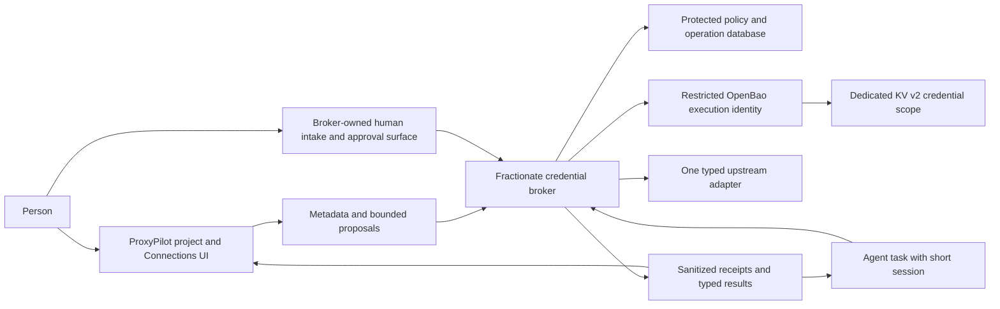

# B0 cloud plan: OpenBao Agent Vault and Fractionate credential broker

Prepared 2026-10-01. Status: **planning proposal, ready for contract review**.
This document does not claim implementation, agreement, CI success, deployment,
credential migration or pilot acceptance. Current authorization is cloud B0
planning only. No production code, runtime, network settings or credentials changed.

## 1. Evidence and baseline

Cloud checkout: `/workspace/ProxyPilot`, branch `work`, clean at investigation
start. Commit `06e2c354bdd1c9dae2203e5447e14dbb84d4a3b8`, PR #716 merge;
tree `40b552baf5e52f2c94c2f0ee9c04b60c611dc213`. That tree matches the reviewed
tree in the operator’s handoff. This does not establish the current production HEAD.
Remote: https://github.com/CyberTechArmor/ProxyPilot . No fetch/push or live
host access was performed. Source links below are pinned to that commit, unless explicitly described
as proposals.

Authoritative scope: the private implementation handoff, retained separately.
This historical B0 document records the initial planning scope. See the current
implementation reference and evidence for subsequent work.

No AGENTS.md was found beneath `/workspace`; no `.agents/skills` directory
exists in the checkout or workspace. Reviewed applicable [CLAUDE.md](https://github.com/CyberTechArmor/ProxyPilot/blob/06e2c354bdd1c9dae2203e5447e14dbb84d4a3b8/CLAUDE.md),
relevant [LEARNINGS.md](https://github.com/CyberTechArmor/ProxyPilot/blob/06e2c354bdd1c9dae2203e5447e14dbb84d4a3b8/LEARNINGS.md) guidance, and
[MOBILE_FIRST.md](https://github.com/CyberTechArmor/ProxyPilot/blob/06e2c354bdd1c9dae2203e5447e14dbb84d4a3b8/admin/frontend/MOBILE_FIRST.md). Particularly relevant
learnings: test effects under real configuration; do not count fixture-only
paths as deployed evidence; preserve mockup hierarchy; report partial states;
account-bound sign-in and observed sign-out are separate claims.

Design reference: the supplied project and agent setup design bundle, with
`agent-connections.png`, `add-connection.png` and `design-and-prompts.json`.
Private source identifiers and personal filesystem paths are retained only in
the private handoff. Original image pixels were not available in this cloud
inventory; do not claim pixel-identical visual verification.

### Reusable code and gaps

| Evidence | What exists | Reuse / required addition |
| --- | --- | --- |
| [OpenBao machine agents](https://github.com/CyberTechArmor/ProxyPilot/blob/06e2c354bdd1c9dae2203e5447e14dbb84d4a3b8/admin/backend/src/lib/setup-engine/openbao-agents.js), lines 15–40, 55–152; [guide](https://github.com/CyberTechArmor/ProxyPilot/blob/06e2c354bdd1c9dae2203e5447e14dbb84d4a3b8/docs/features/agents.md) | Names-only registry; per-agent AppRole; read on its own KV data and read/list on metadata; transient-root management; one-time SecretID display | Keep compatible. Do not issue this identity to a broker consumer or use transient-root management during execution. New dedicated namespace and execution identity required. |
| [Infisical machine agents](https://github.com/CyberTechArmor/ProxyPilot/blob/06e2c354bdd1c9dae2203e5447e14dbb84d4a3b8/admin/backend/src/lib/setup-engine/infisical-agents.js), lines 87–163 | Per-agent project, own-project Admin identity, proxy Viewer, credential host patterns and substitution surfaces | Source inventory only. Its identity can access secrets; proxy substitution alone is not nondisclosure. |
| [Agent network](https://github.com/CyberTechArmor/ProxyPilot/blob/06e2c354bdd1c9dae2203e5447e14dbb84d4a3b8/admin/backend/src/lib/setup-engine/agent-network.js) | Exact container UUID/address link, Infisical-only /32 allowance and hosts entry, stale-link sweep | Inventory consumers and links; do not reuse as blanket broker private-network permission or modify now. |
| [OpenBao routes](https://github.com/CyberTechArmor/ProxyPilot/blob/06e2c354bdd1c9dae2203e5447e14dbb84d4a3b8/admin/backend/src/routes/openbao.js), [Infisical routes](https://github.com/CyberTechArmor/ProxyPilot/blob/06e2c354bdd1c9dae2203e5447e14dbb84d4a3b8/admin/backend/src/routes/infisical.js), [OpenBao UI](https://github.com/CyberTechArmor/ProxyPilot/blob/06e2c354bdd1c9dae2203e5447e14dbb84d4a3b8/admin/frontend/src/components/OpenBaoAgents.jsx), [Infisical UI](https://github.com/CyberTechArmor/ProxyPilot/blob/06e2c354bdd1c9dae2203e5447e14dbb84d4a3b8/admin/frontend/src/components/InfisicalAgents.jsx) | Existing setup/admin flows, fresh local proof, credential entry and audit | Reuse security patterns, not authority semantics. New Connections is a permission-filtered Operations flow, not an admin list of all private secrets. |
| [A4 broker](https://github.com/CyberTechArmor/ProxyPilot/blob/06e2c354bdd1c9dae2203e5447e14dbb84d4a3b8/scripts/a4-credential-broker.py), Vault at line 301, Broker at 461; [installer](https://github.com/CyberTechArmor/ProxyPilot/blob/06e2c354bdd1c9dae2203e5447e14dbb84d4a3b8/scripts/a4-install-broker.py), [operator](https://github.com/CyberTechArmor/ProxyPilot/blob/06e2c354bdd1c9dae2203e5447e14dbb84d4a3b8/scripts/a4-broker-operator.py) | Restricted AppRole reads, pinned binding revisions, durable model reservations, uncertain-call recovery, root-owned Unix service, one fixed browser credential delivery | Reuse reviewed invariants and tests. Do not generalize by extending its demo paths/VM constant or exposing its operator socket. Browser FIFO delivers a secret into trusted guest machinery; API broker must keep key outside guest. |
| [A4 metadata](https://github.com/CyberTechArmor/ProxyPilot/blob/06e2c354bdd1c9dae2203e5447e14dbb84d4a3b8/admin/backend/src/lib/operational-credential-bindings.js), [migration 1110](https://github.com/CyberTechArmor/ProxyPilot/blob/06e2c354bdd1c9dae2203e5447e14dbb84d4a3b8/admin/backend/src/lib/operational-credential-binding-schema.js) | Exact demo origin, one active binding/profile, vault version/revision metadata, permanent revoke | Separate general connection tables; preserve existing schema and pilot. Current public binding includes vault locator: new general public projections must omit it. |
| [Operations schema](https://github.com/CyberTechArmor/ProxyPilot/blob/06e2c354bdd1c9dae2203e5447e14dbb84d4a3b8/admin/backend/src/lib/operational-projects-schema.js), [logic](https://github.com/CyberTechArmor/ProxyPilot/blob/06e2c354bdd1c9dae2203e5447e14dbb84d4a3b8/admin/backend/src/lib/operational-projects-logic.js), [store](https://github.com/CyberTechArmor/ProxyPilot/blob/06e2c354bdd1c9dae2203e5447e14dbb84d4a3b8/admin/backend/src/lib/operational-projects-store.js) | Projects with name/description, explicit roles, ownership, archive, revisions, immutable guide versions | Map purpose to description. Preserve IDs and permissions. Add atomic initial people/access creation with existing role validation; do not use Dev Studio IDs. |
| [Agent schema](https://github.com/CyberTechArmor/ProxyPilot/blob/06e2c354bdd1c9dae2203e5447e14dbb84d4a3b8/admin/backend/src/lib/operational-agents-schema.js), [store](https://github.com/CyberTechArmor/ProxyPilot/blob/06e2c354bdd1c9dae2203e5447e14dbb84d4a3b8/admin/backend/src/lib/operational-agents-store.js), [routes](https://github.com/CyberTechArmor/ProxyPilot/blob/06e2c354bdd1c9dae2203e5447e14dbb84d4a3b8/admin/backend/src/routes/operational-projects.js) | Profiles currently constrained to `synthetic_sign_in`; optional approved guide, separate explicit run routes | Introduce a separately discriminated typed API configuration and runner dispatch. A4 coordinator must reject this type. Draft creation must not require guide/vault readiness. |
| [Browser broker](https://github.com/CyberTechArmor/ProxyPilot/blob/06e2c354bdd1c9dae2203e5447e14dbb84d4a3b8/admin/backend/src/lib/operational-browser-broker.js), [supervisor client](https://github.com/CyberTechArmor/ProxyPilot/blob/06e2c354bdd1c9dae2203e5447e14dbb84d4a3b8/admin/backend/src/lib/operational-worker-supervisor.js), [runtime](https://github.com/CyberTechArmor/ProxyPilot/blob/06e2c354bdd1c9dae2203e5447e14dbb84d4a3b8/admin/backend/src/lib/operational-agent-runtime.js) | Fixed synthetic actions, fenced supervisor protocol, receipt verification; configuration fails closed | Preserve; do not route arbitrary API operations through browser controls. Add separate API-task adapter after B1. |
| [Shared frontend client](https://github.com/CyberTechArmor/ProxyPilot/blob/06e2c354bdd1c9dae2203e5447e14dbb84d4a3b8/admin/frontend/src/lib/api.js), lines 26–136 | CSRF, cookie session, sudo/control/local-proof retry | Add explicit one-shot secret transport semantics. Existing automatic retry must not replay intake or rotation body. |
| [Migration allocation](https://github.com/CyberTechArmor/ProxyPilot/blob/06e2c354bdd1c9dae2203e5447e14dbb84d4a3b8/admin/backend/src/db.js), lines 162–164 and 2048–2050 | Operations migrations currently through 1112 | Tentatively reserve next free Operations allocation at implementation time; do not edit old migrations or promise 1113 remains free. Broker database has a separate schema version. |
| [Security CI](https://github.com/CyberTechArmor/ProxyPilot/blob/06e2c354bdd1c9dae2203e5447e14dbb84d4a3b8/.github/workflows/security-regression.yml) | Operations authorization tests and Python suites, plus security checks | Add real disposable broker/OpenBao integration and browser journeys. CLAUDE's older “only static CI” description is stale. No CI run was inspected or triggered today. |

Supporting inventory references: [guided OpenBao](https://github.com/CyberTechArmor/ProxyPilot/blob/06e2c354bdd1c9dae2203e5447e14dbb84d4a3b8/docs/features/guided-openbao.md),
[guided Infisical](https://github.com/CyberTechArmor/ProxyPilot/blob/06e2c354bdd1c9dae2203e5447e14dbb84d4a3b8/docs/features/guided-infisical.md),
[credential backlog](https://github.com/CyberTechArmor/ProxyPilot/blob/06e2c354bdd1c9dae2203e5447e14dbb84d4a3b8/docs/plans/fractionate-project-credentials-backlog.md),
[host boundary](https://github.com/CyberTechArmor/ProxyPilot/blob/06e2c354bdd1c9dae2203e5447e14dbb84d4a3b8/docs/core/security-host-boundary.md),
[audit register](https://github.com/CyberTechArmor/ProxyPilot/blob/06e2c354bdd1c9dae2203e5447e14dbb84d4a3b8/docs/plans/fractionate-agents-security-audit-register.md),
[A8 reference](https://github.com/CyberTechArmor/ProxyPilot/blob/06e2c354bdd1c9dae2203e5447e14dbb84d4a3b8/docs/plans/fractionate-agents-a8-reference.md),
[A8 evidence](https://github.com/CyberTechArmor/ProxyPilot/blob/06e2c354bdd1c9dae2203e5447e14dbb84d4a3b8/docs/plans/fractionate-agents-a8-evidence.md),
[A8 prompt](https://github.com/CyberTechArmor/ProxyPilot/blob/06e2c354bdd1c9dae2203e5447e14dbb84d4a3b8/docs/plans/fractionate-agents-a8-prompt.md), and
[follow-on plan](https://github.com/CyberTechArmor/ProxyPilot/blob/06e2c354bdd1c9dae2203e5447e14dbb84d4a3b8/docs/plans/fractionate-follow-on-plan.md). Older “not deployed” and
“activation off” comments are historical snapshots, not authoritative current
deployment observations. Historical pilot evidence is distinct from fresh
cloud verification of this broker.

### Versions and present limits

Source pins: OpenBao `openbao/openbao:2.6.2` in
[openbao-logic.js](https://github.com/CyberTechArmor/ProxyPilot/blob/06e2c354bdd1c9dae2203e5447e14dbb84d4a3b8/admin/backend/src/lib/setup-engine/openbao-logic.js#L6);
Infisical `infisical/infisical:v0.165.15` and Agent Proxy
`infisical/cli:0.43.133` in
[infisical-logic.js](https://github.com/CyberTechArmor/ProxyPilot/blob/06e2c354bdd1c9dae2203e5447e14dbb84d4a3b8/admin/backend/src/lib/setup-engine/infisical-logic.js#L6).
Docker is available; read-only `docker ps` returned no running containers.
No `bao` binary was found on PATH. Installed production versions, image digests,
custody and configuration are **unverified**; no live hosts were queried.

Official unversioned OpenBao docs currently show 2.7.x. Planning instead checked
the matching [2.6.x KV v2](https://openbao.org/docs/2.6.x/secrets/kv/kv-v2/),
[AppRole](https://openbao.org/docs/2.6.x/auth/approle/),
[ACL](https://openbao.org/docs/2.6.x/concepts/policies/) and
[Agent/Proxy](https://openbao.org/docs/2.6.x/agent-and-proxy/) references.
AppRole supplies machine authentication and ACLs constrain vault paths; neither
implements the proposed upstream action grants. KV version/CAS semantics are
the enrollment concurrency primitive. OpenBao Proxy remains internal vault
plumbing, not the Fractionate credential-use service. These are planning
references, not proof against an installed server. Confirm exact installed
version and use the corresponding tagged official source before live work.
No new Infisical API behavior is assumed; migration implementation must verify
the version-pinned official references already listed in guided-infisical.md.

## 2. Proposed boundary and bounded first adapter



Recommend a standalone non-root Node service using strict schemas, an isolated
SQLite database for one broker instance, and explicit transactions. This matches
the repository's validation/SQLite experience without importing the privileged
backend runtime. Language choice is a proposal, not a new dependency today.
Do not share the broker DB, signing keys, tokens, sockets or secret volume with
the dashboard. No Incus, Docker, generic shell or root capability in execution.
Split provisioning, enrollment and execution identities. Enrollment can write
only its reviewed credential scope; execution can only read approved exact
credential data/metadata and manage its own bounded token lifetime. Neither can
change ACLs, enable mounts, mint broad tokens or access other namespaces.

Dedicated mount proposal: `fractionate-broker-kv`, paths
`owners/<opaque-owner-id>/credentials/<credential-id>` with project association
in protected policy. No user-supplied path and no names/emails in path segments.
Use per-owner/pilot execution identity with exact credential ACL entries, not a
global wildcard. Project transfer does not silently move/copy credentials.
Actual mount and role installation belong to reviewed provisioning later.

Development adapter `synthetic-ledger-v1` has precisely:

- `item.read`: input `{resource_id: UUID}`; output `{resource_id, state}` where
  state is `open|closed`. Safe connection test uses one preconfigured item.
- `item.set_state`: input `{resource_id: UUID, state: open|closed}`; fresh exact
  approval required; output `{resource_id, state, applied: boolean}`.

Output resource IDs must equal the requested ID; the broker returns its own
validated ID rather than echoing an upstream string. Only locally generated canary credentials; one disposable upstream and real
disposable OpenBao at the verified pin. Server-owned fixture target, fixed TLS
port and test CA, exact fixture address exception in disposable networking;
never a production private-range exception. Deny unknown output fields rather
than returning arbitrary text. The minimal finite result schema reduces echo
risk; fixture upstream still remains a trusted credential recipient. Hostile
variants deliberately echo credentials to prove they are rejected, including
JSON/unicode/base64/url encodings, headers and error bodies. No model provider
call is necessary to prove the bounded API consumer.

### Real deployment choice, needed later

Recommend broker, its intake surface, policy authority and vault custody outside
the root-equivalent ProxyPilot host/hypervisor domain for protection from that
backend. A different container on the same host does not achieve that. Moving
only the broker while the same host can read the vault/bootstrap does not either.
Tradeoff: separate host administration, identity integration and backup custody.
Same-host deployment may demonstrate protection from the agent VM only, with
explicit acceptance of backend/host administrators as trusted. S6/SEC-01 stays
open in either case until its own requirements are actually resolved.

For the stronger boundary, broker verifies human identity directly through its
own authenticated session and fresh proof, with issuer/audience/nonce/expiry
validation and identity mapping held in its protected policy. ProxyPilot's
signature alone is never human authorization. New ceilings and expansions are
confirmed on that independent surface with exact digest and target principal.
The dashboard can propose or narrow changes; it cannot establish a wider ceiling.
Secret input must be broker-origin UI, not a dashboard-owned password field
that merely POSTs elsewhere. The dashboard modal may explain the handoff and
receive a value-free receipt. Returning status uses a one-time correlation ID,
never a credential/token in a URL. Exact origin, identity provider trust and
fresh-proof mechanism are release decisions, not assumed from Keycloak's presence.

Account, project and task eligibility must also be current. Broker owns explicit
eligibility epochs and deny states. Legitimate application disable/archive/end
events use a durable revocation outbox and broker acknowledgement; UI cannot
claim broker revocation completed before acknowledgement. Every send requires
online current eligibility; loss of authority feed fails closed. If project/task
facts remain solely asserted by ProxyPilot, a compromised backend can conceal
their changes. Document that remaining trust; the stronger deployment needs an
independently authenticated authority/approval path for those facts as well.
Independent ceilings bound abuse but do not magically authenticate task intent.
Prove this trust decision before real keys; synthetic proofs need no such key.

## 3. Contract v1 proposed for backend and UI agreement

All objects: opaque UUID IDs, UTC timestamps, integer revision >=1, strict field
allowlists, bounded strings/collections, no unknown fields. Operations project
and agent IDs are typed separately from Dev Studio and machine registry names.
Numbers for money use integer micro-USD; unknown cost is null with explicit
`usage_state=unknown`, never zero. API contract version is `broker.v1`.

### Storage ownership and records

| Record / authority | Required fields beyond ID/revision/timestamps |
| --- | --- |
| Existing Operations project / dashboard | name (1–200), description/purpose (0–20,000), owner, existing named roles and visibility, archive state. Creation requires only name/purpose/people-access, no agent/guide/vault. Initial memberships validate and commit atomically. |
| Agent configuration / dashboard, broker receives authorized projection | project_id, workflow_type (`synthetic_sign_in` existing or new `typed_api_v1`), lifecycle (`draft|disabled|enabled|archived`), Work, Controls, guide ID/hash/version or null, environment ID or null. Creation always draft with execution disabled. |
| Credential / broker | contributor_id, owner_id, project_id nullable, internal vault_ref, vault_version, type=`static_api_token`, state=`pending|active|rotation_pending|reconcile_required|revoked`, enrollment_id. No value or reusable secret digest in metadata. |
| Connection / broker | owner_id, project_id nullable, name, adapter_id/version, configured target ID (not caller URL), credential_id, permitted resource IDs/operations, limits, approval_policy, state=`saved|active|disabled|revoked`, policy_revision. Test result stored with exact tested revisions. |
| Permission / broker | connection_id, principal user ID, rights subset of `view,use,assign,manage`, allowed manage actions, target project/agent ceiling, operation/resource/limit ceiling, expires_at, active/revoked, authorizing_event_id. No implicit admin/project membership access. |
| Assignment / broker | connection_id, exact user_id/project_id/agent_id, parent_permission_id/revision, narrowed operations/resources/limits/expiry, active/revoked, authorizing_event_id. Revocation is permanent; replacement gets a new ID. |
| Eligibility / broker | subject_kind (`user|project|agent|task`), subject_id, epoch, enabled/denied, source authority and source revision, acknowledgement event. Missing/currently unreadable means deny. |
| Session / broker | verifier of random 256-bit bearer, audience, user/project/agent/task, assignment/permission/connection/credential revisions, eligibility epochs, scope, expires_at, revoked_at, attempt/fence. Bearer returned once only to authorized runtime; never dashboard DB/log. |
| Enrollment / broker | intent_id, person, owner/project, connection/credential IDs allocated first, expected KV version, exact intent digest, expiry, state, readback result and metadata commit receipt. No secret body persisted in this journal. |
| Approval / broker | human identity/proof event, canonical operation digest, all scope/revision pins, expiry, state=`pending|approved|consumed|invalidated`; consumption transactional with send reservation. |
| Operation / broker | caller-scoped idempotency key, canonical input digest, session/connection IDs, all revision pins, approval ID, state, upstream correlation, bounded typed result, known/unknown usage, timestamps, recovery/linked-operation reference. No arbitrary bodies in logs. |
| Receipt/event / broker | sequence, actor identities, event type, IDs/revisions, fixed outcome, send boundary, timing, cost status and signature/key ID where used. Metadata-only dashboard projection. |

Agent Work schema: `name`, `role`, `task`, `expected_outcome`, `inputs[]` of typed
references, `guide_ref|null`, `supporting_material[]` references,
`environment_ref|null`. Narrative fields capped at 4 KiB each, at most 32
references; names max 200. Controls: approved operation/resource subsets,
`max_seconds`, `max_actions`, optional `max_tokens`, `max_cost_microusd`,
`approval_policy`, output destination reference and escalation user references.
Absent limits mean unfinished, not unlimited. Scheduling unsupported in this
slice. Connection assignments are separate records, not copied secret fields
inside Work or Controls. Existing A4 records are not auto-converted.

The current profile CHECK only admits `synthetic_sign_in`; implementation needs
a new migration rebuilding/extending the constrained table with FK/history
preservation and tests, plus sidecar configuration fields. Do not weaken old
run validation to accommodate the new discriminator. Keep route response
compatibility for existing clients; new setup routes return contract v1.

### Permission intersection

Effective use = current user/project eligibility ∩ connection policy ∩ explicit
use permission ∩ agent assignment ∩ task/session scope ∩ demonstrated upstream
permissions ∩ applicable Controls. Lists intersect by exact ID; numeric maxima
take the minimum; expiry takes earliest; approvals take the stricter policy.
No wildcards or implicit inheritance in v1. An assignment never grants use to
someone without an eligible explicit use right. Assign authority requires both
an explicit assign ceiling and current edit authority over that target agent.
Manage actions are enumerated (`rename,test,rotate,revoke,permissions`); only an
explicit permission-administration grant plus fresh human authorization may
change permissions, never global administrator status alone. No reveal action.

Owner change, credential rotation, material policy change, parent permission
change, account disable, project archive and task end bump appropriate epochs
or revisions and invalidate sessions/approvals. Removing one assignment bumps
only its dependent authorization. No cloning of private permissions with an
agent. Metadata-only rename can increment record revision without policy revision;
sessions pin policy revision, and UI ETag pins record revision.

### HTTP conventions and endpoints

Dashboard metadata prefix: `/api/connections`; existing project prefix is
`/api/operational-projects`. Broker APIs below use `/v1` on the separately
configured broker origin. Proposed paths, not currently implemented.

Mutations use `If-Match: "<revision>"` where a record exists (same numeric
convention as Operations), with ETag on responses. Creates have a UUID
`Idempotency-Key`, unique per actor/endpoint; same key plus different canonical
metadata is conflict. Secret submissions use intent ID and write-once semantics,
not a public secret hash. All authenticated responses are no-store. Pagination
is opaque cursor + limit 1–100, default 25; counts and cursors are access-filtered.

| Method / path | Input and result / gate |
| --- | --- |
| POST existing project prefix | Extend validated input with initial members/visibility; name and description remain compatible. 201 project + ETag; no run. |
| POST `.../:project/agent-configurations` | Work/Controls + workflow type; 201 draft, disabled, readiness. Unknown/unsupported workflows cannot execute. |
| GET/PATCH `.../:project/agent-configurations/:agent` | Current projection / revision-checked edits; require existing project access/edit. No assignment side effects hidden in PATCH. |
| GET `.../:project/agent-configurations/:agent/readiness` | Revision-bound reasons; reuse approved guide publication/withdrawal semantics. |
| GET `/api/connections/capabilities` | contract version, available adapters, deployment compatibility, intake/use flags and fixed reasons. No hidden connection data. |
| GET `/api/connections?project_id=&assignable_to_agent_id=` | One catalogue queried in global or project context; picker enforces assign AND target edit eligibility. |
| GET `/api/connections/:id` | permitted metadata, version/status, effective rights; no vault path or secret. |
| GET `/api/connections/:id/{assignments,sessions,activity}` | Access-filtered pages; session metadata only, never bearer/verifier. |
| POST broker `/v1/enrollment-intents` | Human fresh proof; service, name, ownership/project, optional rotation target/revision; 201 short-lived intent, IDs and receipt locator, no secret. |
| POST broker `/v1/enrollment-intents/:id/credential` | Once-only `{value}` static token <=16 KiB, correct authenticated intent/person; 202 receipt. Never generic client auto-retry. |
| GET broker `/v1/enrollment-intents/:id` | Metadata durable status; lost response resolved here, without resubmitting value. |
| POST broker `/v1/connections/:id/test` | Explicit safe read, manage:test + fresh proof, record/credential revision pins; 202 operation receipt. |
| PATCH broker `/v1/connections/:id` | name and reviewed policy changes only; manage authority, If-Match and human expansion approval where necessary. |
| POST broker `/v1/connections/:id/assignments` | exact target identities, proposed subset/expiry/limits and expected parent revisions; assign ceiling plus target edit eligibility; 201 assignment. |
| POST broker `/v1/assignments/:id/revoke` | Fresh authorized action + If-Match; 200 receipt listing only permitted affected sessions/in-flight operation IDs; does not revoke connection. |
| POST broker `/v1/connections/:id/revoke` | manage:revoke + fresh proof + If-Match; disables all dependent future sends; 200 acknowledged cutoff receipt. |
| POST broker `/v1/connections/:id/rotation-intents` | Same trusted intake process, CAS expected version, manage:rotate; no value in dashboard request. |
| POST broker `/v1/sessions` | Authenticated registered runtime and broker-authorized task/fence; exact assignment + narrower scope + <=300-second TTL. Not callable by session bearer. |
| POST broker `/v1/operations` | Session bearer; `{connection_id,operation,input,approval_id?}` and Idempotency-Key; pins resolved from session, never supplied vault versions/URLs/headers. 201 read result/receipt or 202 pending write. |
| GET broker `/v1/operations/:id` | Same authorized task/session or authorized human view; bounded receipt/result. Expired bearer cannot query; human can resolve status. |
| POST broker `/v1/operations/:id/approval` | Broker-owned human fresh proof, exact digest/expiry; 200 decision. Agent cannot approve. |
| POST broker `/v1/operations/:id/reconciliation` | Human proof, fixed disposition and evidence reference; records resolution, never resends. New write needs new linked operation + fresh approval. |

Dashboard mutations are bounded proposals/links to independently verified broker
actions in the stronger boundary. Do not silently proxy credential bodies through
the dashboard. Shared CSRF/fresh-auth helpers remain on same-origin metadata
calls; broker-origin surface applies its own CSRF/origin/session proof. If a
same-host pilot instead uses dashboard intake, explicitly document transient
backend access and obtain that exact trust decision before activation.

### Error envelope and readiness

All new APIs return failures as
`{error:{code,message,request_id,retryable,next_action},contract_version:"broker.v1"}`.
Message is fixed safe text, not provider/validator/raw network output.
`next_action` is an allowlisted UI action ID, never a server-supplied external URL.
Adapt this envelope in the shared client without breaking existing Operations
errors. No original body appears in errors. Secret-bearing calls never replay
because `retryable=true`; it only permits checking status or starting fresh proof.

| HTTP | Codes |
| --- | --- |
| 400 | INVALID_REQUEST, UNSUPPORTED_OPERATION, UNSUPPORTED_CREDENTIAL_TYPE |
| 401 | AUTH_REQUIRED, FRESH_PROOF_REQUIRED, SESSION_INVALID, SESSION_EXPIRED |
| 403 | NOT_PERMITTED, SCOPE_EXCEEDED, APPROVAL_REQUIRED (only for visible objects) |
| 404 | NOT_FOUND (same hidden/absent response, including unauthorized project context) |
| 409 | REVISION_MISMATCH, IDEMPOTENCY_CONFLICT, ENROLLMENT_RECONCILE_REQUIRED, APPROVAL_STALE, OPERATION_UNCERTAIN, TASK_ENDED |
| 413 / 428 / 429 | REQUEST_TOO_LARGE / REVISION_REQUIRED / LIMIT_EXCEEDED |
| 502 / 503 | UPSTREAM_PROTOCOL / BROKER_UNAVAILABLE, VAULT_UNAVAILABLE, VAULT_SEALED, POLICY_UNAVAILABLE, ELIGIBILITY_UNAVAILABLE, CONTRACT_INCOMPATIBLE |

Unauthorized callers do not receive a revoked/existing distinction. Authorized
callers get explicit state in the readable projection. No outcome after possible
send is marked retryable execution. Availability failures never release an
uncertain write into a resend path.

Readiness response:

```json
{
  "contract_version": "broker.v1",
  "assessment_id": "opaque-uuid",
  "agent_id": "opaque-uuid",
  "pins": {"agent_revision": 1, "project_revision": 1, "policy_revision": 1},
  "state": "blocked",
  "can_start": false,
  "execution_enabled": false,
  "checks": [
    {"kind": "guide", "state": "unfinished", "code": "GUIDE_REQUIRED", "next_action": "select_approved_guide"},
    {"kind": "broker", "state": "unavailable", "code": "BROKER_NOT_ACTIVATED", "next_action": "view_activation_status"}
  ]
}
```

Full pins also include guide version/hash, environment revision, each
connection policy/credential/assignment revision and eligibility epochs.
Overall state `ready|blocked`; check state
`ready|unfinished|unverified|unavailable|failed|revoked|stale`.
Check kinds: `deployment,broker,vault,enrollment,test,assignment,adapter,guide,practice,environment`.
Reason codes additionally include `CONTRACT_INCOMPATIBLE,VAULT_SEALED,
ENROLLMENT_PENDING,ENROLLMENT_RECONCILE_REQUIRED,CONNECTION_UNTESTED,
TEST_STALE,ASSIGNMENT_REQUIRED,ASSIGNMENT_REVOKED,ADAPTER_UNSUPPORTED,
GUIDE_STALE,PRACTICE_REQUIRED,ENVIRONMENT_UNAVAILABLE,POLICY_CHANGED`.
Unknown contract/check state fails closed. Assessment is advisory and expires
after 30 seconds; execution re-evaluates current state, never trusts cached UI.
Applicable approved guide skips redundant training/approval. Practice is an
explicit run only if the workflow requires it. All required checks must pass,
then a separately authorized enable and explicit start are still required.

### Synthetic fixture set shared by both branches

Use named data fixtures `owner_unfinished`, `owner_saved_unassigned`,
`owner_verified_assigned`, `use_only`, `assign_narrow_ceiling`, `other_owner_hidden`,
`assignment_revoked`, `credential_rotated`, `guide_reused`, `unsupported_browser`,
`unsupported_oauth`, `broker_offline`, `contract_mismatch`, `enrollment_partial`,
`write_uncertain`. Fixed nonsecret IDs and expected response/error/check codes;
no token strings in UI fixtures. These fixture names and schemas are contract
proposals; create executable JSON/OpenAPI/Zod artifacts in the B0 contract PR
before backend/UI implementation diverges. No claim those artifacts exist today.

## 4. Durable lifecycle and confidentiality rules

Enrollment: reserve IDs + intent → fresh proof → single secret submission → KV
CAS write → internal versioned readback → commit active credential/connection
metadata → receipt. New path requires CAS=0; rotate requires current version.
Put intent ID as nonsecret enrollment metadata with the KV write so recovery can
correlate it. Crash after possible KV write becomes `reconcile_required`; check
the exact path/version/intent, do not blind-write a new version. Unmatched writes
remain quarantined and visible to the owner, never invisible orphans. No reusable
value hash in evidence. Clear the field on submission; request closure must not
retain it for authentication retry. Rotation enters a blocking state and bumps
authorization before changing the vault; partial rotation cannot leave old
sessions usable. A safe test uses the committed version before readiness returns.

Save and assign is a composed UI journey, not an atomic fiction: show separate
enrollment, safe-test and assignment receipts. Assignment failure retains saved
connection and offers assignment retry without secret resubmission. The shared
catalogue appears globally and inside project Access; identical connection IDs.

Writes: validate → reserve durable operation/digest → pending exact approval →
transactionally consume approval and reserve limits → final eligibility/revision
check → persist `sending` → one upstream send → persist `succeeded|failed|uncertain`.
Also allow `denied|cancelled` before send. Crash in `sending` is conservatively
uncertain even if the bytes might not have left. No automatic resend on restart,
timeout, response loss or an idempotent HTTP verb. Duplicate request returns its
existing operation; different digest with same key is rejected. Recovery records
a human decision and any new operation links to the old one with fresh approval.

Canonical digest: deterministic canonical JSON of typed operation/input, exact
user/project/agent/task/attempt/fence, resource and all pinned revisions, audience
and expiry; reject duplicate JSON keys, malformed UTF-8, NaN and unknown fields.
Approval expires in at most 120 seconds and once consumed cannot be reactivated.

Revocation and final send authorization serialize through one broker dispatcher
per connection in this first single-instance design. Queued work must recheck
after obtaining the dispatcher lock. A revocation acknowledgement establishes a
cutoff: subsequent dispatches are denied; previously dispatched operations are
reported in flight/uncertain. No claim to undo upstream acceptance. Multi-instance
dispatch needs a separately proven lease/fencing design; do not scale SQLite by
sharing a volume between independent brokers.

Outbound defaults proposed for synthetic proof: fixed approved target and port,
TLS hostname verification, validate every resolved address and pin chosen socket
address, no proxy env inheritance, redirects refused, no cookies, no caller auth
headers, 16 KiB request body, 32 KiB upstream body, identity encoding only,
2-second connect / 5-second total deadline, one concurrent call per connection,
10 calls per minute and 20 per task. Resource UUIDs produce fixed adapter paths;
reject encoded separators, URL-looking input, duplicate headers and header
newlines before send. Deny loopback, metadata, link-local, vault, management and
private targets except the exact isolated fixture target configured by test
operator. Real adapter must choose and test its own reviewed bounds.

Secrets exist only in trusted intake memory, OpenBao and execution memory plus
the selected upstream. No durable secret cache. AppRole bootstrap resides only
in protected broker custody; tokens memory-only with actual server lease bounds,
never a hardcoded extension beyond expiry. Restart authenticates again; failed
renewal/sealed vault denies use. Rotation of SecretID alone does not revoke
already-issued tokens; explicit token accessor revocation and broker session
invalidation are separate controls. Root provisioning remains outside requests.

Audit proposal: 90-day redacted operations/events retained for pilot, restricted
owner/permitted-view access; private encrypted backups with separately held key,
signed exports and monotonic sequence checks. Database append-only rules are
not proof against administrators. Do not call the audit immutable. Restore must
invalidate all pre-restore session/approval epochs, reconcile possible sends and
test exact vault version agreement before any reactivation. Retention/custody
policy needs live acceptance before a real pilot.

## 5. UI implementation contract

Preserve visible project list and selected project detail; Agents contains
Work → Connections → Controls → Review. Pale blue selected project, outlined
cards with scope within selected card, narrow assigned summary, navy headings,
blue actions, and centered Add connection dialog on desktop. Use existing
components/tokens where they match; compare with original assets before review.
On phones use full-screen accessible dialog, stacked cards, proper focus/escape
behavior, 44px primary targets and no horizontal scrolling. Verify 360/375/390/
768/1280/1920 widths and Lighthouse mobile accessibility >=90.

Project creation only name/purpose/people-access. Agent create saves draft and
shows missing readiness steps. Show existing assignable connections versus Add
connection explicitly. API token is the only new supported intake type; browser
and OAuth choices remain unavailable with explanation. Model-provider selection
does not prove that provider is broker-supported; existing A4 provider stays its
own bounded integration. No extra model adapter is implied by the mockup.
Test, rotate, revoke and remove-from-agent each show exact affected scope and
actual completion. Show stale sessions and already dispatched work. Real secret
controls stay disabled unless broker/backend/required runner compatibility and
activation are confirmed server-side; synthetic previews are clearly labelled.

## 6. Verification plan (not executed today)

| Test family | Required observable result |
| --- | --- |
| Valid read/write | Typed allowed read succeeds; approved write produces one upstream effect, durable receipt and correct cost state. |
| Authorization matrix | Wrong user/agent/project/connection/resource/audience/expiry/revision denies with zero sends; hidden object matches absent response; picker/save/use agree. |
| Permission separation | Use cannot assign/manage; assign cannot exceed ceiling; manage:test cannot arbitrary-write/reveal; unassign preserves other users' assignments. |
| Vault ACL | Real OpenBao runtime identity denies provisioning and other namespaces; agent session cannot log into/read vault; selected version/CAS races verified on real server. |
| Lifecycle | Disable/archive/end/rotation/revoke invalidates old sessions and approval; concurrent dispatch/revoke proves cutoff and in-flight disclosure. |
| Durable writes | Crash before reservation, before send marker, after marker, after upstream acceptance, before receipt; duplicate and raced approval cause no automatic resend. |
| Network | Rebinding, multi-answer DNS, IPv4/IPv6 special addresses, redirects, parser/encoded-path/header attacks, slow/large/compressed responses: zero unapproved destination sends and fixed safe errors. |
| Secret sinks | Canary absent from agent output/prompt, dashboard DB, logs/audit, receipts, screenshots/errors/artifacts across success and encoded echo cases. Explicitly exclude trusted vault/intake/upstream memory from claim. |
| Enrollment | CAS conflict, proof expiry, lost response, partial write/readback/metadata commit, retry after auth, saved-but-unassigned and failed assignment all preserve truthful state without secret replay. |
| Availability/recovery | Sealed/unavailable vault, expired token, unavailable policy/identity authority, process restart, corrupt/stale state, backup/restore and rollback deny use until reconciled. |
| Browser journeys | Project creation with no guide/vault; all four sections; guide reuse; optional assignment; wrong owner; mobile/keyboard; unsupported types; readiness failure and recovery; rotate/revoke. |
| Compatibility | Existing OpenBao/Infisical machine flows and A4 remain unchanged; affected A3/A4/A5/A7 regressions run when shared contracts/components change. Deferred evidence is not a pass. |

Disposable integration suite must exercise real TLS upstream, real pinned
OpenBao image, real ACLs and actual DB transactions. Pure mocks only support UI
fixtures and unit fault injection. Capture commit/tree, resolved image digest,
nonsecret configuration digest, case IDs, upstream effect count, sanitized
receipts and limitations. No dependency/security checks suppressed; compare
baseline failures with recorded exact commit if they occur.

## 7. Metadata-only migration dry run

Select one legacy consumer explicitly later. Read registry names/IDs, source
project/environment/path/key NAME, source version, proxied service ID,
hostPattern/surfaces, linked container UUID/IP and authorized consumer mapping.
Never read values for the dry run; mark source version `unverified` if obtaining
it would require authority not available. Match by explicit person/Operations
project/agent selection, never machine name similarity.

Each row: `source_kind,source_identity_id,source_credential_name,source_version,
consumer_id,owner_id,ops_project_id,target_connection_id,target_credential_id,
target_adapter,operations,resources,legacy_network_link,disposition,reason`.
Target IDs/path references are allocated metadata, not secrets. Disposition
`mappable|unsupported|owner_required|consumer_required|source_changed|blocked`.
Wildcard hosts, query/body substitution, OAuth/browser-only consumers or unknown
semantics remain unsupported; alternative is retain that legacy consumer or
design a separate typed adapter. No broad gateway fallback.

Later authorized transfer uses a bounded service-held source session, source
version checks before/after, target KV CAS, memory-only value transfer and
internal readback. Durable receipt handles partial writes and source changes.
Cut over only after restore/rollback proof, grant/revocation tests and real pilot
approval. Remove selected consumer's old direct-read/proxy authority and verify
denial, then prove broker-only operation. Provider-side rotation is needed to
invalidate previously copied keys where applicable. Keep other identities,
source data and Infisical installed. Rollback restores reviewed configuration,
never revives revoked sessions or replays uncertain work. No migration ran here.

## 8. Delivery sequence and decisions

1. **B0 contract review:** agree this proposal's authority/intake model, typed
   adapter, records, errors, readiness and fixtures. Verify image version and
   retrieve original design assets; turn contracts into schema/OpenAPI and
   fixture files with positive/negative contract tests. Resolve migration
   allocation and exact identity bridge. B0 is not “accepted” merely by saving
   this planning document.
2. **Separate worktrees/PRs after agreement:** `broker-foundation` owns broker
   service, protected DB, ACLs, typed adapter and disposable proofs;
   `agent-connections-ui` owns project/agent flow, catalogue, dialog/readiness
   using the frozen synthetic contract; a contracts base PR is shared.
   Backend owns main-DB migrations to avoid collisions. No branches created now.
3. **B2/B3 integration:** wire real metadata/intake receipts and one API consumer;
   preserve A4 runner and run controls. Compare joint contract tests, mobile
   journeys, unsafe retry tests and canary evidence. No automatic real intake.
4. **Release preparation:** review exact commit and required CI, deployment
   placement, approved manifest, backups/restore/rollback and exact destination/
   port effects. Prepare guarded root paste the operator runs, detached for long
   steps. No SSH/MCP host workaround. No merge/undraft/close without his word.
5. **Activation gate:** independently verify backend/broker/required runner
   deployed, healthy and compatible before enabling real intake/use. Then one
   explicitly selected consumer/pilot; verify old authority removed and observe
   rotation/revoke/recovery. B5 needs the operator’s explicit scope acceptance.

Recommended first real service, **proposal only**: GitHub Issues read-only for
one disposable private repository with a dedicated fine-grained credential
limited to that repository and Issues read permission (plus provider-required
metadata). Operation returns only issue number/state, not arbitrary issue text.
The [official Get an issue documentation](https://docs.github.com/en/rest/issues/issues#get-an-issue)
was consulted for this proposal. Recheck versioned endpoint and permission
semantics in the real-adapter slice before selecting it; this plan does not implement GitHub or claim a live token
has those permissions. Read-only limits real effects; synthetic adapter proves
write approval/uncertainty meanwhile. No repository selected and no issue created.

Only live decisions needed from the operator later:

- Exact trusted placement/custody and human-auth/intake origin, including whether
  the backend remains trusted for project/task facts. Recommendation is the
  separate privilege domain above; operational overhead is the tradeoff.
- Exact pilot owner, repository/service resource, agent/consumer, permission
  scope and duration; then explicit key enrollment/pilot authorization.
- Exact reviewed release/root paste and cutover/rollback scope after CI and
  recovery evidence, not an abstract deployment approval now.

No live decision is needed to finish this plan or subsequently prove synthetic
contracts once implementation is authorized. User absence is not approval.

## 9. Status and deferred register

| Area | Status at this deliverable |
| --- | --- |
| B0 | Source inventory and concrete contract proposal documented; agreement and executable contract artifacts pending. |
| Local implementation | None in this task; only this new planning document. |
| Tests / CI | No application tests, integration proofs or CI run; read-only source inspection and document checks only. |
| Deployment/activation | None performed. Cloud has no running service containers. Production not inspected. |
| Pilot | No new live broker pilot verified by this inventory. |
| A8 | Separate acceptance and host verification remain outside this workstream. |
| Deferred A8 | Interrupted interactive A5 proof and affected fresh host regressions/report; uncertain-step stop/reconcile/linked recovery; isolated rollback/disk growth/Windows off-host backup verification. |
| Security | S6/SEC-01 open. Same-host service separation does not remove root-equivalent backend trust. |
| Later capabilities | General browser/password, new OAuth/refresh, dynamic DB credentials, transparent interception, broad SDK/CLI, personal vault imports, full Infisical retirement, replication and F1–F7 remain separate. |

Preserve pp-nodus, nodus.fractionate.ai, router mappings, MEET/TURN routes/ports,
Incus state, protected snapshots/backups/custody/receipt keys and historical
evidence. No deferral closes a finding or grants A8 acceptance.
